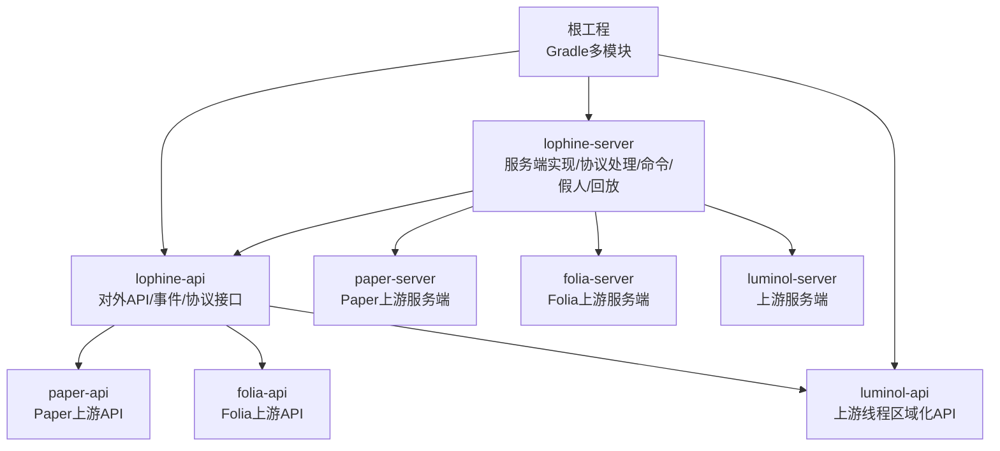
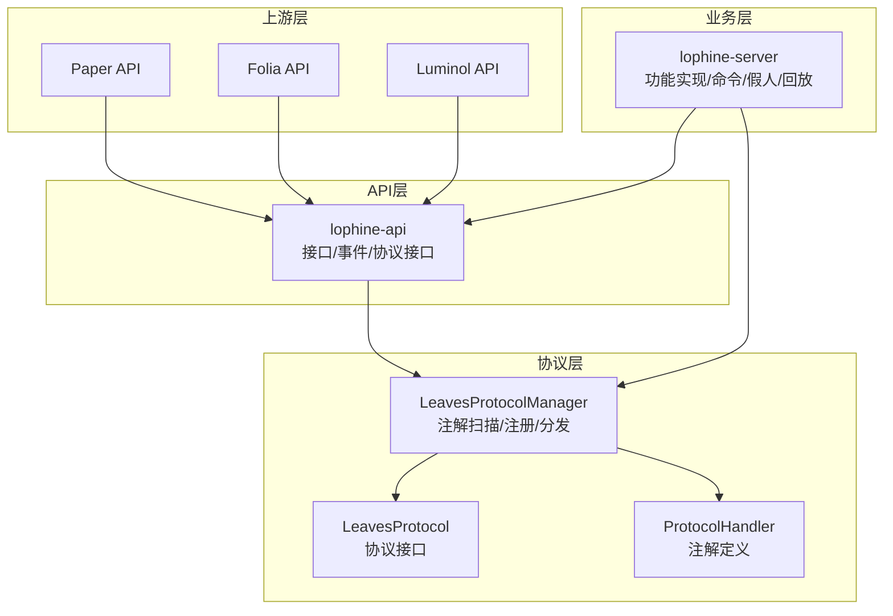
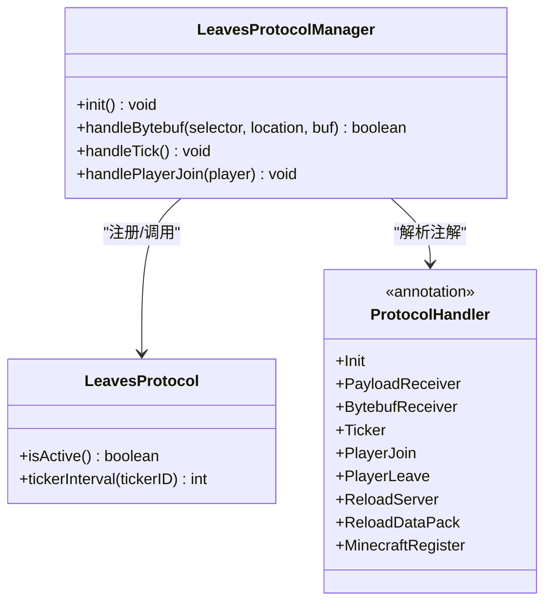
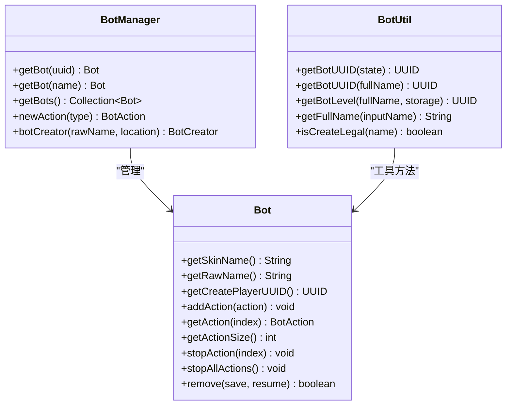
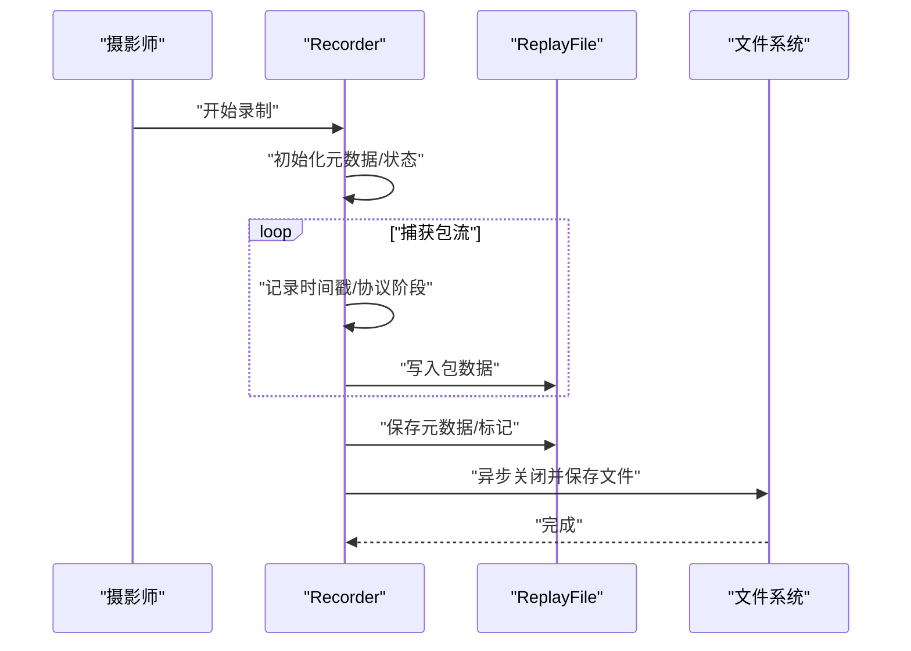
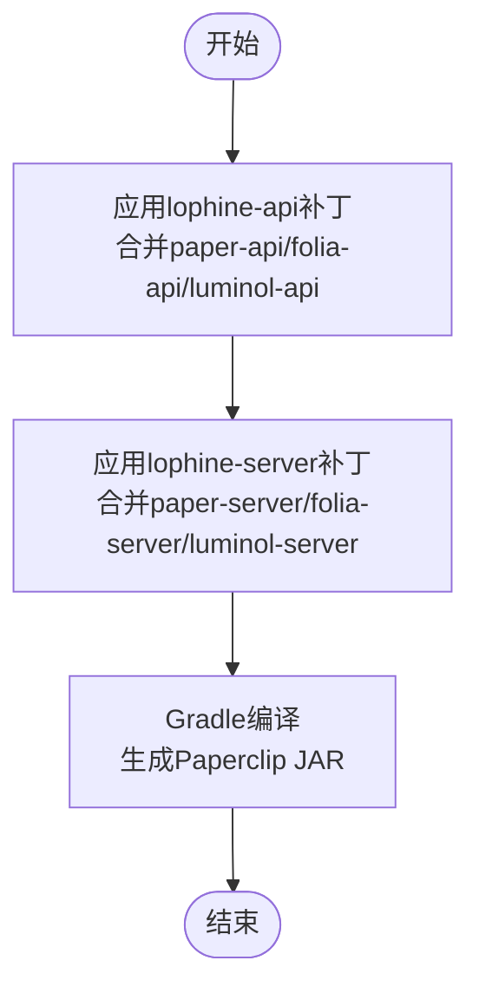
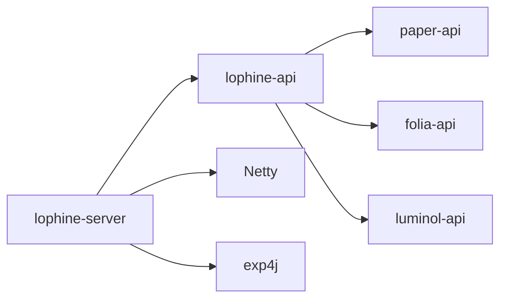

# 技术架构概览

<cite>
**本文档引用的文件**
- [build.gradle.kts](file://build.gradle.kts)
- [settings.gradle.kts](file://settings.gradle.kts)
- [gradle.properties](file://gradle.properties)
- [README.md](file://README.md)
- [lophine-api\build.gradle.kts.patch](file://lophine-api\build.gradle.kts.patch)
- [lophine-server\build.gradle.kts.patch](file://lophine-server\build.gradle.kts.patch)
- [lophine-api\src\main\java\org\leavesmc\leaves\event\bot\BotEvent.java](file://lophine-api\src\main\java\org\leavesmc\leaves\event\bot\BotEvent.java)
- [lophine-server\src\main\java\org\leavesmc\leaves\protocol\core\LeavesProtocol.java](file://lophine-server\src\main\java\org\leavesmc\leaves\protocol\core\LeavesProtocol.java)
- [lophine-server\src\main\java\org\leavesmc\leaves\protocol\core\LeavesProtocolManager.java](file://lophine-server\src\main\java\org\leavesmc\leaves\protocol\core\LeavesProtocolManager.java)
- [lophine-server\src\main\java\org\leavesmc\leaves\protocol\core\ProtocolHandler.java](file://lophine-server\src\main\java\org\leavesmc\leaves\protocol\core\ProtocolHandler.java)
- [lophine-api\src\main\java\org\leavesmc\leaves\entity\bot\Bot.java](file://lophine-api\src\main\java\org\leavesmc\leaves\entity\bot\Bot.java)
- [lophine-api\src\main\java\org\leavesmc\leaves\entity\bot\BotManager.java](file://lophine-api\src\main\java\org\leavesmc\leaves\entity\bot\BotManager.java)
- [lophine-server\src\main\java\org\leavesmc\leaves\bot\BotUtil.java](file://lophine-server\src\main\java\org\leavesmc\leaves\bot\BotUtil.java)
- [lophine-server\src\main\java\org\leavesmc\leaves\replay\Recorder.java](file://lophine-server\src\main\java\org\leavesmc\leaves\replay\Recorder.java)
- [lophine-server\src\main\java\org\leavesmc\leaves\replay\ReplayFile.java](file://lophine-server\src\main\java\org\leavesmc\leaves\replay\ReplayFile.java)
- [luminol-api\src\main\java\gg\pufferfish\pufferfish\sentry\SentryContext.java](file://luminol-api\src\main\java\gg\pufferfish\pufferfish\sentry\SentryContext.java)
</cite>

## 目录
1. [引言](#引言)
2. [项目结构](#项目结构)
3. [核心组件](#核心组件)
4. [架构总览](#架构总览)
5. [详细组件分析](#详细组件分析)
6. [依赖关系分析](#依赖关系分析)
7. [性能考量](#性能考量)
8. [故障排查指南](#故障排查指南)
9. [结论](#结论)

## 引言
本文件面向Lophine项目的开发者与维护者，提供系统性的技术架构概览。Lophine是一个基于Luminol的分支，专注于在Folia平台上提供高性能、可配置且具备扩展能力的服务端实现。其整体架构围绕模块化设计展开：通过Gradle多模块管理lophine-api、lophine-server，并以补丁方式集成Paper/Folia上游API与服务端代码；同时引入协议驱动的插件化通信层，支撑诸如Jade、REI、Servux等可视化与协议扩展。

技术选型方面，Lophine采用PaperMC/Folia作为运行时框架，结合Luminol的线程区域化与性能优化能力，配合Java 21/Kotlin语言工具链与Gradle构建系统，形成稳定高效的开发与发布流水线。项目强调事件驱动与协议驱动，通过注解扫描与反射机制实现动态注册与分发，确保功能模块的松耦合与可插拔。

## 项目结构
Lophine采用标准的Gradle多模块布局，根工程负责统一插件与仓库配置，子模块按职责划分：
- lophine-api：对外API与事件模型，包含假人实体、事件体系与协议接口定义
- lophine-server：服务端实现，整合Paper/Folia上游补丁与Luminol特性，提供协议处理、命令系统、假人与回放功能
- luminol-api：上游Luminol提供的线程区域化与性能相关API（由补丁合并到lophine-api）

模块间依赖关系清晰：lophine-server依赖lophine-api，而lophine-api再聚合paper-api、folia-api与luminol-api的源码与资源，最终由Gradle的patcher插件完成补丁应用与编译。

图表来源
- [settings.gradle.kts:23-25](file://settings.gradle.kts#L23-L25)
- [build.gradle.kts:9-41](file://build.gradle.kts#L9-L41)
- [lophine-api\build.gradle.kts.patch:1-28](file://lophine-api\build.gradle.kts.patch#L1-L28)
- [lophine-server\build.gradle.kts.patch:7-25](file://lophine-server\build.gradle.kts.patch#L7-L25)

章节来源
- [settings.gradle.kts:1-25](file://settings.gradle.kts#L1-L25)
- [build.gradle.kts:46-109](file://build.gradle.kts#L46-L109)
- [gradle.properties:1-18](file://gradle.properties#L1-L18)

## 核心组件
- 多模块构建与补丁系统
  - 根工程通过paperweight插件定义上游仓库与补丁映射，自动应用paper-api、folia-api与luminol-api的补丁，输出到paper-api、folia-api与luminol-api目录供lophine-api消费
  - lophine-server通过自定义fork“lophine”继承luminol，并应用额外补丁，最终产出Paperclip可运行JAR
- 协议驱动的通信层
  - LeavesProtocol接口与LeavesProtocolManager通过注解扫描注册协议处理器，支持Payload接收、字节流接收、Ticker、玩家生命周期回调、Minecraft注册回调等
  - ProtocolHandler定义了Init、PayloadReceiver、BytebufReceiver、Ticker、PlayerJoin/Leave、ReloadServer、ReloadDataPack、MinecraftRegister等注解，用于声明式注册
- 假人系统
  - lophine-api定义Bot与BotManager接口，抽象出假人的生命周期、动作队列与管理能力
  - lophine-server提供BotUtil等工具类，负责UUID生成、合法性校验、世界绑定等
- 回放系统
  - Recorder与ReplayFile协作，将客户端包流写入临时目录，支持元数据与标记文件生成，最终异步落盘保存

章节来源
- [build.gradle.kts:9-41](file://build.gradle.kts#L9-L41)
- [lophine-server\build.gradle.kts.patch:7-25](file://lophine-server\build.gradle.kts.patch#L7-L25)
- [lophine-api\build.gradle.kts.patch:1-28](file://lophine-api\build.gradle.kts.patch#L1-L28)
- [lophine-server\src\main\java\org\leavesmc\leaves\protocol\core\LeavesProtocol.java:26-39](file://lophine-server\src\main\java\org\leavesmc\leaves\protocol\core\LeavesProtocol.java#L26-L39)
- [lophine-server\src\main\java\org\leavesmc\leaves\protocol\core\LeavesProtocolManager.java:45-200](file://lophine-server\src\main\java\org\leavesmc\leaves\protocol\core\LeavesProtocolManager.java#L45-L200)
- [lophine-server\src\main\java\org\leavesmc\leaves\protocol\core\ProtocolHandler.java:28-103](file://lophine-server\src\main\java\org\leavesmc\leaves\protocol\core\ProtocolHandler.java#L28-L103)
- [lophine-api\src\main\java\org\leavesmc\leaves\entity\bot\Bot.java:30-103](file://lophine-api\src\main\java\org\leavesmc\leaves\entity\bot\Bot.java#L30-L103)
- [lophine-api\src\main\java\org\leavesmc\leaves\entity\bot\BotManager.java:31-65](file://lophine-api\src\main\java\org\leavesmc\leaves\entity\bot\BotManager.java#L31-L65)
- [lophine-server\src\main\java\org\leavesmc\leaves\bot\BotUtil.java:129-176](file://lophine-server\src\main\java\org\leavesmc\leaves\bot\BotUtil.java#L129-L176)
- [lophine-server\src\main\java\org\leavesmc\leaves\replay\Recorder.java:65-279](file://lophine-server\src\main\java\org\leavesmc\leaves\replay\Recorder.java#L65-L279)
- [lophine-server\src\main\java\org\leavesmc\leaves\replay\ReplayFile.java:52-83](file://lophine-server\src\main\java\org\leavesmc\leaves\replay\ReplayFile.java#L52-L83)

## 架构总览
Lophine的整体架构遵循“上游补丁 + 模块化API + 协议驱动 + 功能实现”的分层设计：
- 上游层：Paper/Folia API与服务端由补丁系统注入，保证兼容性与性能
- API层：lophine-api提供对外接口与事件模型，屏蔽底层差异
- 协议层：LeavesProtocolManager集中注册与调度各类协议处理器，实现事件与数据的解耦分发
- 业务层：lophine-server实现具体功能（假人、回放、命令、配置同步等），并通过协议层与外部可视化/协议生态对接

图表来源
- [build.gradle.kts:9-41](file://build.gradle.kts#L9-L41)
- [lophine-api\build.gradle.kts.patch:1-28](file://lophine-api\build.gradle.kts.patch#L1-L28)
- [lophine-server\src\main\java\org\leavesmc\leaves\protocol\core\LeavesProtocolManager.java:45-200](file://lophine-server\src\main\java\org\leavesmc\leaves\protocol\core\LeavesProtocolManager.java#L45-L200)
- [lophine-server\src\main\java\org\leavesmc\leaves\protocol\core\LeavesProtocol.java:26-39](file://lophine-server\src\main\java\org\leavesmc\leaves\protocol\core\LeavesProtocol.java#L26-L39)
- [lophine-server\src\main\java\org\leavesmc\leaves\protocol\core\ProtocolHandler.java:28-103](file://lophine-server\src\main\java\org\leavesmc\leaves\protocol\core\ProtocolHandler.java#L28-L103)

## 详细组件分析

### 协议驱动架构（LeavesProtocolManager）
LeavesProtocolManager是协议层的核心，负责：
- 扫描指定包下的协议实现类，解析注解并建立注册表
- 维护Payload接收器、字节流接收器、Ticker、玩家生命周期回调、Minecraft注册回调等多类处理器
- 提供统一的分发入口，按阶段与键空间匹配路由到对应处理器

图表来源
- [lophine-server\src\main\java\org\leavesmc\leaves\protocol\core\LeavesProtocol.java:26-39](file://lophine-server\src\main\java\org\leavesmc\leaves\protocol\core\LeavesProtocol.java#L26-L39)
- [lophine-server\src\main\java\org\leavesmc\leaves\protocol\core\ProtocolHandler.java:28-103](file://lophine-server\src\main\java\org\leavesmc\leaves\protocol\core\ProtocolHandler.java#L28-L103)
- [lophine-server\src\main\java\org\leavesmc\leaves\protocol\core\LeavesProtocolManager.java:45-200](file://lophine-server\src\main\java\org\leavesmc\leaves\protocol\core\LeavesProtocolManager.java#L45-L200)

章节来源
- [lophine-server\src\main\java\org\leavesmc\leaves\protocol\core\LeavesProtocolManager.java:45-200](file://lophine-server\src\main\java\org\leavesmc\leaves\protocol\core\LeavesProtocolManager.java#L45-L200)
- [lophine-server\src\main\java\org\leavesmc\leaves\protocol\core\LeavesProtocol.java:26-39](file://lophine-server\src\main\java\org\leavesmc\leaves\protocol\core\LeavesProtocol.java#L26-L39)
- [lophine-server\src\main\java\org\leavesmc\leaves\protocol\core\ProtocolHandler.java:28-103](file://lophine-server\src\main\java\org\leavesmc\leaves\protocol\core\ProtocolHandler.java#L28-L103)

### 假人系统（Bot API与实现）
lophine-api定义了Bot与BotManager接口，抽象出假人的生命周期、动作队列与管理能力；lophine-server提供BotUtil等工具类，负责UUID生成、合法性校验、世界绑定等。

图表来源
- [lophine-api\src\main\java\org\leavesmc\leaves\entity\bot\Bot.java:30-103](file://lophine-api\src\main\java\org\leavesmc\leaves\entity\bot\Bot.java#L30-L103)
- [lophine-api\src\main\java\org\leavesmc\leaves\entity\bot\BotManager.java:31-65](file://lophine-api\src\main\java\org\leavesmc\leaves\entity\bot\BotManager.java#L31-L65)
- [lophine-server\src\main\java\org\leavesmc\leaves\bot\BotUtil.java:129-176](file://lophine-server\src\main\java\org\leavesmc\leaves\bot\BotUtil.java#L129-L176)

章节来源
- [lophine-api\src\main\java\org\leavesmc\leaves\entity\bot\Bot.java:30-103](file://lophine-api\src\main\java\org\leavesmc\leaves\entity\bot\Bot.java#L30-L103)
- [lophine-api\src\main\java\org\leavesmc\leaves\entity\bot\BotManager.java:31-65](file://lophine-api\src\main\java\org\leavesmc\leaves\entity\bot\BotManager.java#L31-L65)
- [lophine-server\src\main\java\org\leavesmc\leaves\bot\BotUtil.java:129-176](file://lophine-server\src\main\java\org\leavesmc\leaves\bot\BotUtil.java#L129-L176)

### 回放系统（Recorder与ReplayFile）
回放系统通过Recorder捕获客户端包流，ReplayFile负责将包与元数据写入临时目录并在后台线程异步落盘保存。

图表来源
- [lophine-server\src\main\java\org\leavesmc\leaves\replay\Recorder.java:65-279](file://lophine-server\src\main\java\org\leavesmc\leaves\replay\Recorder.java#L65-L279)
- [lophine-server\src\main\java\org\leavesmc\leaves\replay\ReplayFile.java:52-83](file://lophine-server\src\main\java\org\leavesmc\leaves\replay\ReplayFile.java#L52-L83)

章节来源
- [lophine-server\src\main\java\org\leavesmc\leaves\replay\Recorder.java:65-279](file://lophine-server\src\main\java\org\leavesmc\leaves\replay\Recorder.java#L65-L279)
- [lophine-server\src\main\java\org\leavesmc\leaves\replay\ReplayFile.java:52-83](file://lophine-server\src\main\java\org\leavesmc\leaves\replay\ReplayFile.java#L52-L83)

### 构建与补丁流程
下图展示了从上游仓库到最终产物的关键步骤：应用补丁、合并源码、编译打包。

图表来源
- [build.gradle.kts:9-41](file://build.gradle.kts#L9-L41)
- [lophine-api\build.gradle.kts.patch:1-28](file://lophine-api\build.gradle.kts.patch#L1-L28)
- [lophine-server\build.gradle.kts.patch:7-25](file://lophine-server\build.gradle.kts.patch#L7-L25)

章节来源
- [build.gradle.kts:9-41](file://build.gradle.kts#L9-L41)
- [lophine-api\build.gradle.kts.patch:1-28](file://lophine-api\build.gradle.kts.patch#L1-L28)
- [lophine-server\build.gradle.kts.patch:7-25](file://lophine-server\build.gradle.kts.patch#L7-L25)

## 依赖关系分析
- 模块依赖
  - lophine-server → lophine-api（实现依赖API接口）
  - lophine-api → paper-api、folia-api、luminol-api（源码与资源合并）
- 运行时依赖
  - Java 21工具链与UTF-8编码设置
  - Maven中央仓库与PaperMC/MenthaMC私有仓库
  - 测试运行时JUnit平台
- 外部库
  - Netty用于网络I/O优化
  - exp4j用于简单计算器表达式求值（Carpet兼容）

图表来源
- [build.gradle.kts:46-109](file://build.gradle.kts#L46-L109)
- [lophine-server\build.gradle.kts.patch:48-54](file://lophine-server\build.gradle.kts.patch#L48-L54)
- [lophine-server\src\main\java\fun\bm\lophine\carpet\CarpetCalculatorCompatHelper.java:7](file://lophine-server\src\main\java\fun\bm\lophine\carpet\CarpetCalculatorCompatHelper.java#L7)

章节来源
- [build.gradle.kts:46-109](file://build.gradle.kts#L46-L109)
- [lophine-server\build.gradle.kts.patch:48-54](file://lophine-server\build.gradle.kts.patch#L48-L54)

## 性能考量
- 线程区域化与区域化渲染
  - 基于Luminol的线程区域化能力，减少全局锁竞争，提升大规模实体与区块更新场景的吞吐
- 协议处理的异步化
  - 协议分发与包保存采用异步执行与单线程保存服务，降低主线程阻塞风险
- 编译与构建优化
  - 启用配置缓存、构建缓存、并行构建与可重现归档顺序，缩短CI/本地构建时间
- 字符集与编码
  - 统一UTF-8编码，避免资源处理中的字符集问题

章节来源
- [README.md:25-30](file://README.md#L25-L30)
- [build.gradle.kts:12-15](file://build.gradle.kts#L12-L15)
- [build.gradle.kts:70-80](file://build.gradle.kts#L70-L80)

## 故障排查指南
- 协议未生效或未被发现
  - 检查协议类是否标注LeavesProtocol.Register，方法是否标注相应注解（如PayloadReceiver、BytebufReceiver等）
  - 确认LeavesProtocolManager.init()已执行并完成扫描
- 包保存异常或异步写入失败
  - 查看Recorder日志中关于异步保存的错误提示，确认是否有插件在异步修改数据导致冲突
- 假人创建失败
  - 校验名称合法性、唯一性与数量限制，检查BotUtil的合法性校验逻辑
- 线程区域化相关问题
  - 参考luminol-api中的线程区域化上下文与统计信息，定位区域化任务调度异常

章节来源
- [lophine-server\src\main\java\org\leavesmc\leaves\protocol\core\LeavesProtocolManager.java:71-124](file://lophine-server\src\main\java\org\leavesmc\leaves\protocol\core\LeavesProtocolManager.java#L71-L124)
- [lophine-server\src\main\java\org\leavesmc\leaves\replay\Recorder.java:246-253](file://lophine-server\src\main\java\org\leavesmc\leaves\replay\Recorder.java#L246-L253)
- [lophine-server\src\main\java\org\leavesmc\leaves\bot\BotUtil.java:161-176](file://lophine-server\src\main\java\org\leavesmc\leaves\bot\BotUtil.java#L161-L176)
- [luminol-api\src\main\java\gg\pufferfish\pufferfish\sentry\SentryContext.java:139-181](file://luminol-api\src\main\java\gg\pufferfish\pufferfish\sentry\SentryContext.java#L139-L181)

## 结论
Lophine通过模块化与补丁化的构建策略，将Paper/Folia与Luminol的优势整合，形成稳定的API与服务端实现；借助协议驱动的注解扫描机制，实现了高内聚、低耦合的功能扩展点。假人与回放等核心功能在该架构下得以清晰分离与高效实现。建议开发者在新增功能时优先考虑协议扩展与API抽象，遵循事件驱动与模块化设计原则，以保持系统的可维护性与可扩展性。