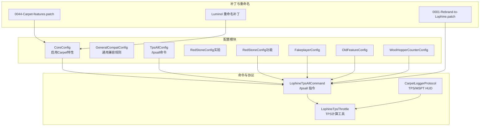
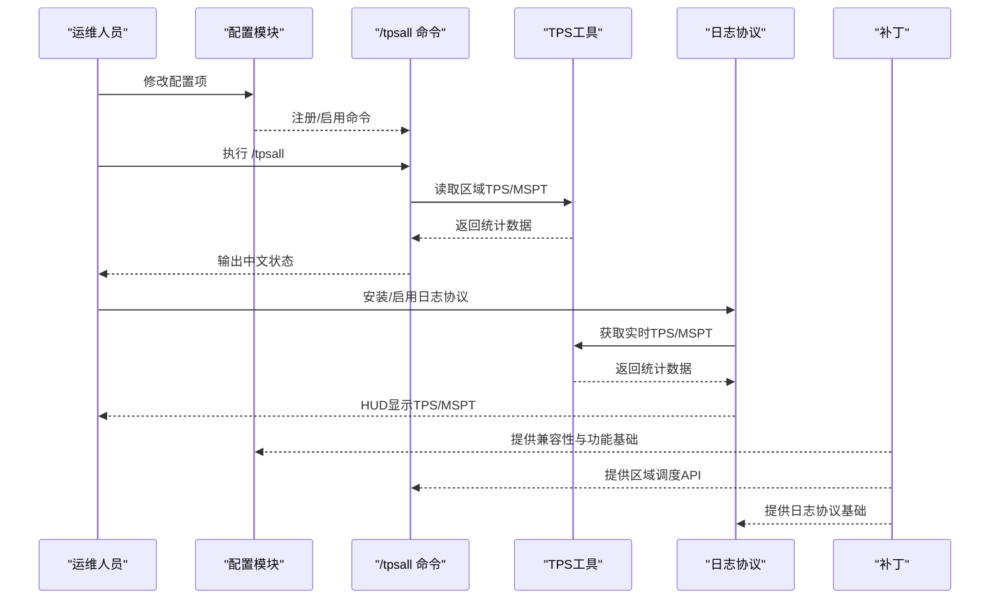
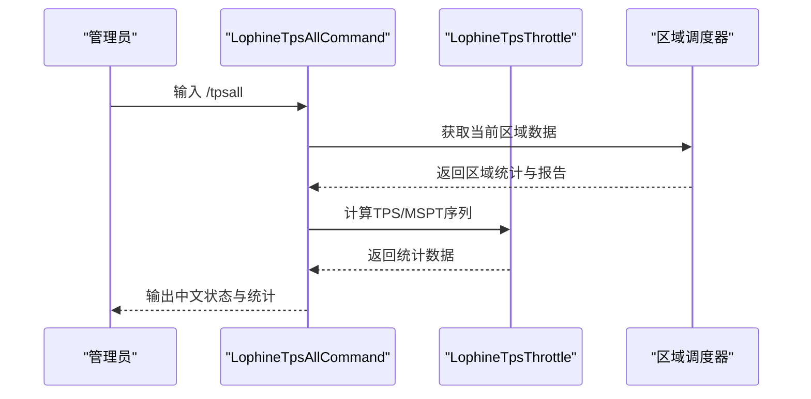
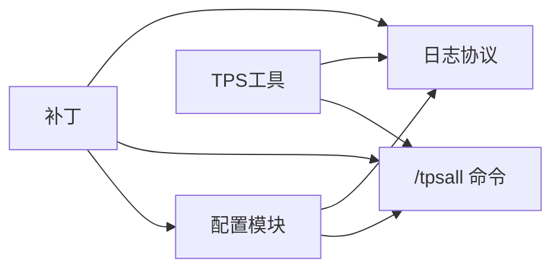

# 核心特性详解

<cite>
**本文引用的文件**
- [README_EN.md](file://README_EN.md)
- [CoreConfig.java](file://lophine-server/src/main/java/fun/bm/lophine/carpet/config/modules/CoreConfig.java)
- [GeneralCompatConfig.java](file://lophine-server/src/main/java/fun/bm/lophine/carpet/config/modules/GeneralCompatConfig.java)
- [TpsAllConfig.java](file://lophine-server/src/main/java/fun/bm/lophine/config/modules/function/TpsAllConfig.java)
- [LophineTpsAllCommand.java](file://lophine-server/src/main/java/fun/bm/lophine/feature/LophineTpsAllCommand.java)
- [LophineTpsThrottle.java](file://lophine-server/src/main/java/fun/bm/lophine/utils/LophineTpsThrottle.java)
- [CarpetLoggerProtocol.java](file://lophine-server/src/main/java/fun/bm/lophine/protocol/CarpetLoggerProtocol.java)
- [RedStoneConfig.java（实验）](file://lophine-server/src/main/java/fun/bm/lophine/config/modules/experiment/RedStoneConfig.java)
- [RedStoneConfig.java（功能）](file://lophine-server/src/main/java/fun/bm/lophine/config/modules/function/RedStoneConfig.java)
- [FakeplayerConfig.java](file://lophine-server/src/main/java/fun/bm/lophine/config/modules/function/FakeplayerConfig.java)
- [OldFeatureConfig.java](file://lophine-server/src/main/java/fun/bm/lophine/config/modules/function/OldFeatureConfig.java)
- [WoolHopperCounterConfig.java](file://lophine-server/src/main/java/fun/bm/lophine/config/modules/function/WoolHopperCounterConfig.java)
- [0001-Rebrand-to-Lophine.patch](file://lophine-server/paper-patches/features/0001-Rebrand-to-Lophine.patch)
- [0044-Carpet-features.patch](file://lophine-server/minecraft-patches/features/0044-Carpet-features.patch)
- [0001-Rebrand-to-Lophine.patch（Luminol）](file://luminol-api/src/main/java/org/leavesmc/leaves/plugin/Features.java)
</cite>

## 目录
1. 引言
2. 项目结构
3. 核心组件
4. 架构总览
5. 详细组件分析
6. 依赖分析
7. 性能考量
8. 故障排查指南
9. 结论
10. 附录

## 引言
本文件面向希望在Folia环境下部署Minecraft服务器的管理员与开发者，系统化阐述Lophine项目的六大核心特性：可配置的原版特性、TPS监控支持、Folia兼容性修复、多存档格式支持、红石功能增强与其他实用功能。我们将从实现原理、配置方法、使用场景与性能影响等维度展开，并结合命令与协议层的实际代码位置，帮助您基于服务器需求做出合理选择与优化。

## 项目结构
Lophine由服务端模块与API模块组成，核心能力通过“配置模块 + 命令/协议扩展 + 补丁”三者协同实现：
- 配置模块：集中于功能开关与行为参数，覆盖实验性与功能性两大类别
- 命令与协议：提供可视化与第三方工具集成能力（如TPS显示、日志协议）
- 补丁与重命名：在构建阶段对上游分支进行品牌与功能层面的适配

图示来源
- [CoreConfig.java:14-29](file://lophine-server/src/main/java/fun/bm/lophine/carpet/config/modules/CoreConfig.java#L14-L29)
- [GeneralCompatConfig.java:18-29](file://lophine-server/src/main/java/fun/bm/lophine/carpet/config/modules/GeneralCompatConfig.java#L18-L29)
- [TpsAllConfig.java:14-45](file://lophine-server/src/main/java/fun/bm/lophine/config/modules/function/TpsAllConfig.java#L14-L45)
- [LophineTpsAllCommand.java:32-101](file://lophine-server/src/main/java/fun/bm/lophine/feature/LophineTpsAllCommand.java#L32-L101)
- [LophineTpsThrottle.java:40-56](file://lophine-server/src/main/java/fun/bm/lophine/utils/LophineTpsThrottle.java#L40-L56)
- [CarpetLoggerProtocol.java:134-302](file://lophine-server/src/main/java/fun/bm/lophine/protocol/CarpetLoggerProtocol.java#L134-L302)
- [0001-Rebrand-to-Lophine.patch:54-80](file://lophine-server/paper-patches/features/0001-Rebrand-to-Lophine.patch#L54-L80)
- [0044-Carpet-features.patch](file://lophine-server/minecraft-patches/features/0044-Carpet-features.patch)
- [0001-Rebrand-to-Lophine.patch（Luminol）](file://luminol-api/src/main/java/org/leavesmc/leaves/plugin/Features.java)

章节来源
- [README_EN.md:23-30](file://README_EN.md#L23-L30)

## 核心组件
- 可配置的原版特性：通过配置模块统一管理Carpet相关功能与通用兼容规则，确保在不破坏原版体验的前提下按需开放高级能力。
- TPS监控支持：提供/tpsall命令与日志协议，输出区域级TPS/MSPT与使用率，辅助定位性能瓶颈。
- Folia兼容性修复：通过补丁与配置联动，解决已知问题并提升稳定性。
- 多存档格式支持：在构建阶段引入不同世界格式的适配补丁，满足多样化存储需求。
- 红石功能增强：在Folia上扩展红石行为，配合Fabric可实现更完整的红石生态。
- 其他实用功能：包括假人、旧版特性复刻、羊毛漏斗计数器等，提升生存与自动化体验。

章节来源
- [README_EN.md:23-30](file://README_EN.md#L23-L30)

## 架构总览
下图展示了从配置到命令与协议的调用链路，以及与补丁的关系：

图示来源
- [TpsAllConfig.java:28-45](file://lophine-server/src/main/java/fun/bm/lophine/config/modules/function/TpsAllConfig.java#L28-L45)
- [LophineTpsAllCommand.java:41-86](file://lophine-server/src/main/java/fun/bm/lophine/feature/LophineTpsAllCommand.java#L41-L86)
- [LophineTpsThrottle.java:40-56](file://lophine-server/src/main/java/fun/bm/lophine/utils/LophineTpsThrottle.java#L40-L56)
- [CarpetLoggerProtocol.java:134-302](file://lophine-server/src/main/java/fun/bm/lophine/protocol/CarpetLoggerProtocol.java#L134-L302)
- [0001-Rebrand-to-Lophine.patch:54-80](file://lophine-server/paper-patches/features/0001-Rebrand-to-Lophine.patch#L54-L80)

## 详细组件分析

### 可配置的原版特性
- 实现原理
  - 通过注解驱动的配置模块定义功能开关与默认值，支持在加载/卸载时注册或注销对应功能。
  - 通用兼容配置将外部生态（如Carpet/AMS/TIS/Org）的规则映射到Lophine现有实现，避免重复造轮子。
- 关键配置
  - 启用Carpet特性：控制通用目录下的功能是否生效，并在加载前应用兼容同步。
  - 语言转发：将Carpet语言设置转发至Lophine的语言配置。
  - 更新抑制崩溃保护：将AMS/TIS的同类修复映射到Lophine的现有机制。
- 使用场景
  - 需要逐步引入Carpet类功能但又保持可控时，优先开启核心开关并按需启用子项。
  - 在多生态共存环境中，通过通用兼容配置减少冲突。
- 性能影响
  - 开启后会增加少量配置解析与兼容同步开销；通常可忽略。
- 最佳实践
  - 建议先启用核心开关，再逐项测试具体功能，以便快速回滚。
  - 对于崩溃保护类功能，建议在生产环境默认开启以提升稳定性。

章节来源
- [CoreConfig.java:9-29](file://lophine-server/src/main/java/fun/bm/lophine/carpet/config/modules/CoreConfig.java#L9-L29)
- [GeneralCompatConfig.java:10-29](file://lophine-server/src/main/java/fun/bm/lophine/carpet/config/modules/GeneralCompatConfig.java#L10-L29)

### TPS监控支持
- 实现原理
  - /tpsall命令：基于区域调度API获取当前区域的TPS、MSPT、使用率与统计信息，并以中文输出。
  - 日志协议：向客户端发送TPS/MSPT HUD，颜色随数值动态变化，便于直观判断性能。
  - TPS工具：提供最近TPS序列计算，作为底层数据源。
- 关键配置
  - 启用/tpsall命令与显示数量：控制命令可用性与区域排行条数。
- 使用场景
  - 运维巡检：定期执行/tpsall查看区域负载与瓶颈。
  - 实时监控：通过日志协议在客户端侧持续观察TPS/MSPT。
- 性能影响
  - 命令本身开销极低；日志协议仅在启用时推送HUD，对服务器压力可忽略。
- 最佳实践
  - 将/tpsall加入巡检脚本，结合日志协议在高负载时段关注区域使用率。
  - 合理设置top-region-count，避免输出过大影响阅读。

图示来源
- [LophineTpsAllCommand.java:41-86](file://lophine-server/src/main/java/fun/bm/lophine/feature/LophineTpsAllCommand.java#L41-L86)
- [LophineTpsThrottle.java:40-56](file://lophine-server/src/main/java/fun/bm/lophine/utils/LophineTpsThrottle.java#L40-L56)

章节来源
- [TpsAllConfig.java:14-45](file://lophine-server/src/main/java/fun/bm/lophine/config/modules/function/TpsAllConfig.java#L14-L45)
- [LophineTpsAllCommand.java:18-101](file://lophine-server/src/main/java/fun/bm/lophine/feature/LophineTpsAllCommand.java#L18-L101)
- [CarpetLoggerProtocol.java:134-302](file://lophine-server/src/main/java/fun/bm/lophine/protocol/CarpetLoggerProtocol.java#L134-L302)

### Folia兼容性修复
- 实现原理
  - 通过补丁在构建阶段替换品牌标识与功能入口，确保与Folia生态兼容。
  - 通用兼容配置将外部崩溃保护策略映射到Lophine现有机制，减少异常导致的服务中断。
- 使用场景
  - 在Folia上运行需要稳定性的服务器时，优先启用相关修复与兼容项。
- 性能影响
  - 主要为构建期变更，运行时无额外开销。
- 最佳实践
  - 在升级上游版本后，检查补丁是否仍适用，必要时更新补丁集。

章节来源
- [0001-Rebrand-to-Lophine.patch:54-80](file://lophine-server/paper-patches/features/0001-Rebrand-to-Lophine.patch#L54-L80)
- [GeneralCompatConfig.java:23-29](file://lophine-server/src/main/java/fun/bm/lophine/carpet/config/modules/GeneralCompatConfig.java#L23-L29)

### 多存档格式支持
- 实现原理
  - 通过补丁引入线性与b_linear（线性重实现）世界格式的支持，满足不同存档策略需求。
- 使用场景
  - 需要在不同世界格式间迁移或混合使用时，选择合适的格式以平衡性能与兼容性。
- 性能影响
  - 不同格式在IO与寻址上存在差异，建议结合服务器硬件与地图规模评估。
- 最佳实践
  - 新建地图建议采用b_linear以获得更好扩展性；历史地图可保留线性格式以保证兼容。

章节来源
- [0001-Rebrand-to-Lophine.patch（Luminol）](file://luminol-api/src/main/java/org/leavesmc/leaves/plugin/Features.java)

### 红石功能增强
- 实现原理
  - 在Folia上扩展红石行为，提供更贴近原版或特定需求的红石逻辑。
  - 与Fabric生态配合可进一步完善红石自动化方案。
- 关键配置
  - 红石相关配置分为实验与功能两类，分别用于探索性与稳定功能。
- 使用场景
  - 高密度自动化农场、红石电路复杂度较高或需要特定行为时。
- 性能影响
  - 红石更新可能带来额外计算，建议在热点区域谨慎使用复杂电路。
- 最佳实践
  - 优先启用功能类配置，实验类配置仅在测试环境验证后再推广。

章节来源
- [RedStoneConfig.java（实验）](file://lophine-server/src/main/java/fun/bm/lophine/config/modules/experiment/RedStoneConfig.java)
- [RedStoneConfig.java（功能）](file://lophine-server/src/main/java/fun/bm/lophine/config/modules/function/RedStoneConfig.java)

### 其他实用功能
- 假人（Fakeplayer）
  - 通过配置启用假人功能，支持自动化任务与演示场景。
- 旧版特性复刻（OldFeature）
  - 提供部分旧版本行为的可选复刻，满足特定玩法需求。
- 羊毛漏斗计数器（WoolHopperCounter）
  - 统计与计数相关行为，辅助自动化与审计。
- 使用场景
  - 自动化农场、演示与教学、审计与合规。
- 性能影响
  - 功能本身开销较小，但需注意与红石/实体上限的综合影响。
- 最佳实践
  - 按需启用，避免在高负载区域同时开启多个重型功能。

章节来源
- [FakeplayerConfig.java](file://lophine-server/src/main/java/fun/bm/lophine/config/modules/function/FakeplayerConfig.java)
- [OldFeatureConfig.java](file://lophine-server/src/main/java/fun/bm/lophine/config/modules/function/OldFeatureConfig.java)
- [WoolHopperCounterConfig.java](file://lophine-server/src/main/java/fun/bm/lophine/config/modules/function/WoolHopperCounterConfig.java)

## 依赖分析
- 组件耦合
  - 配置模块是功能开关中枢，命令与协议均依赖其加载/卸载生命周期。
  - TPS工具为命令与协议提供统一的数据源，降低重复计算。
  - 补丁为整体功能提供基础能力保障（品牌、兼容、功能入口）。
- 外部依赖
  - Paper/Folia的区域调度API与命令框架。
  - 第三方协议（如日志协议）用于向客户端推送状态。
- 循环依赖
  - 当前设计以配置模块为中心，命令/协议围绕其扩展，未见循环依赖迹象。

图示来源
- [TpsAllConfig.java:28-45](file://lophine-server/src/main/java/fun/bm/lophine/config/modules/function/TpsAllConfig.java#L28-L45)
- [LophineTpsAllCommand.java:32-101](file://lophine-server/src/main/java/fun/bm/lophine/feature/LophineTpsAllCommand.java#L32-L101)
- [CarpetLoggerProtocol.java:134-302](file://lophine-server/src/main/java/fun/bm/lophine/protocol/CarpetLoggerProtocol.java#L134-L302)
- [LophineTpsThrottle.java:40-56](file://lophine-server/src/main/java/fun/bm/lophine/utils/LophineTpsThrottle.java#L40-L56)
- [0001-Rebrand-to-Lophine.patch:54-80](file://lophine-server/paper-patches/features/0001-Rebrand-to-Lophine.patch#L54-L80)

## 性能考量
- 命令与协议
  - /tpsall与日志协议均为轻量级输出，对CPU与内存影响微乎其微。
- 功能开关
  - 建议采用“最小可行集”原则：仅启用当前阶段必需的功能，避免叠加过多导致不可控的性能波动。
- 区域调度
  - 在高密度实体/红石场景中，优先关注区域使用率与MSPT，及时拆分区域或优化电路。
- 红石与自动化
  - 复杂红石电路可能引发频繁更新，建议在热点区域减少不必要的更新链路。

## 故障排查指南
- 命令无法使用
  - 检查配置模块是否正确加载与注册；确认权限节点与命令别名生效。
- TPS数据显示异常
  - 确认服务器运行时间足够长以收集统计；检查区域调度器是否正常工作。
- 协议未显示
  - 确认协议已启用且客户端安装了相应插件；检查日志协议的默认选项与支持列表。
- 兼容性问题
  - 若出现崩溃或不稳定，优先启用通用兼容配置中的崩溃保护项；必要时回退到上一版本补丁集。

章节来源
- [TpsAllConfig.java:28-45](file://lophine-server/src/main/java/fun/bm/lophine/config/modules/function/TpsAllConfig.java#L28-L45)
- [LophineTpsAllCommand.java:41-86](file://lophine-server/src/main/java/fun/bm/lophine/feature/LophineTpsAllCommand.java#L41-L86)
- [CarpetLoggerProtocol.java:291-302](file://lophine-server/src/main/java/fun/bm/lophine/protocol/CarpetLoggerProtocol.java#L291-L302)

## 结论
Lophine通过“可配置的原版特性 + TPS监控 + Folia兼容修复 + 多存档格式 + 红石增强 + 实用功能”的组合，为Minecraft服务器提供了更稳健、可观测与可扩展的运行基座。建议以配置模块为入口，结合TPS监控与日志协议进行持续观测，在Folia生态下稳步引入功能，最终形成符合自身业务需求的定制化方案。

## 附录
- 快速参考
  - 启用/禁用/tpsall命令：在功能配置中调整开关与显示数量。
  - 启用日志协议：在协议配置中启用TPS/MSPT HUD。
  - 启用Carpet特性：在核心配置中开启通用功能，并按需启用子项。
  - 启用红石增强：在功能配置中启用所需行为；实验配置仅用于测试。
  - 启用假人/旧版特性/羊毛漏斗计数器：在对应功能配置中开启。