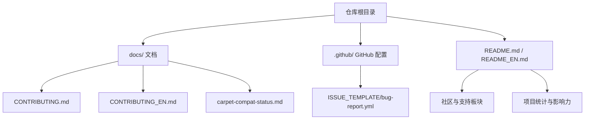
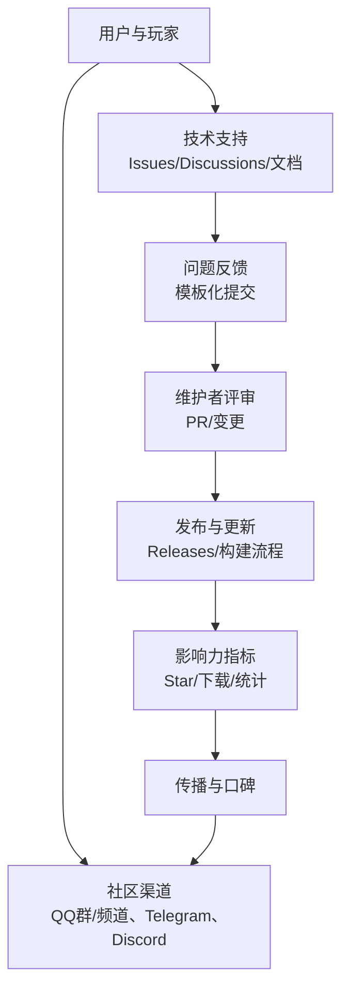
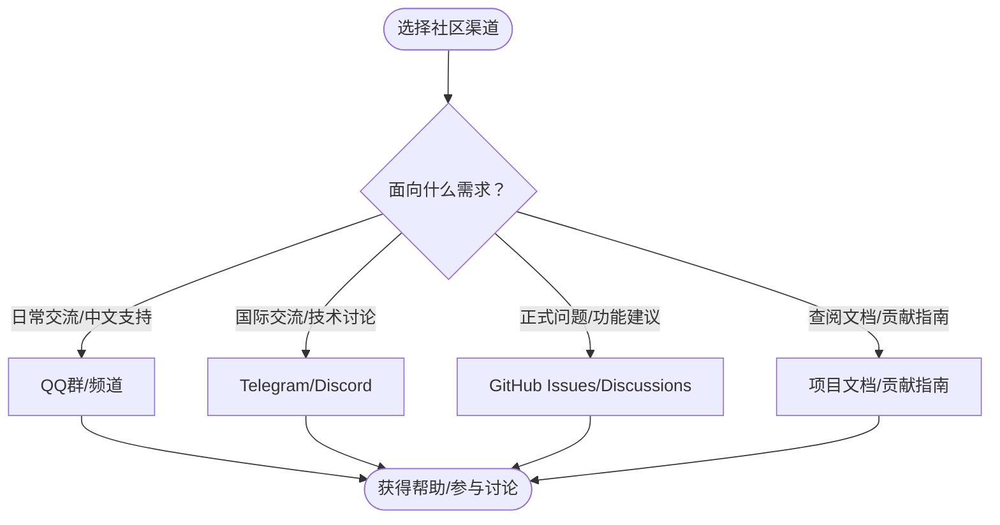
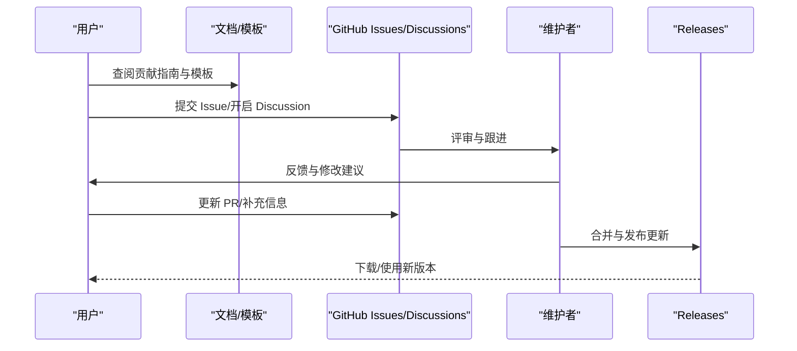
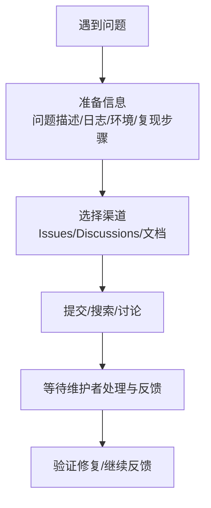
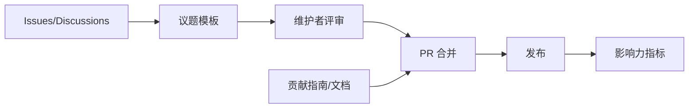

# 社区与生态

<cite>
**本文引用的文件**
- [README.md](file://README.md)
- [README_EN.md](file://README_EN.md)
- [CONTRIBUTING.md](file://docs/CONTRIBUTING.md)
- [CONTRIBUTING_EN.md](file://docs/CONTRIBUTING_EN.md)
- [bug-report.yml](file://.github/ISSUE_TEMPLATE/bug-report.yml)
</cite>

## 目录
1. [引言](#引言)
2. [项目结构](#项目结构)
3. [核心组件](#核心组件)
4. [架构总览](#架构总览)
5. [详细组件分析](#详细组件分析)
6. [依赖分析](#依赖分析)
7. [性能考虑](#性能考虑)
8. [故障排查指南](#故障排查指南)
9. [结论](#结论)
10. [附录](#附录)

## 引言
本章节面向希望参与 Lophine 社区与生态建设的用户与贡献者，系统性介绍社区渠道、治理与协作模式、问题反馈与技术支持路径、生态合作伙伴与影响力指标，并提供新用户入门指引。内容基于仓库中的官方文档与社区链接进行整理，帮助不同背景的读者快速融入。

## 项目结构
Lophine 采用“核心实现 + 多平台社区 + 文档与模板”的组织方式：
- 顶层 README 提供项目简介、下载入口、社区与支持、问题反馈、贡献指南与统计信息
- docs 目录包含中英文贡献指南与兼容性状态文档
- .github 目录包含议题模板（Issue Template），用于规范化问题反馈
- 各类协议与生态集成（如 LegacyLands）通过 README 中的赞助商与生态链接体现

图表来源
- [README.md:88-126](file://README.md#L88-L126)
- [README_EN.md:89-126](file://README_EN.md#L89-L126)
- [CONTRIBUTING.md:1-93](file://docs/CONTRIBUTING.md#L1-L93)
- [CONTRIBUTING_EN.md:1-96](file://docs/CONTRIBUTING_EN.md#L1-L96)
- [.github/ISSUE_TEMPLATE/bug-report.yml](file://.github/ISSUE_TEMPLATE/bug-report.yml)

章节来源
- [README.md:1-157](file://README.md#L1-L157)
- [README_EN.md:1-158](file://README_EN.md#L1-L158)
- [CONTRIBUTING.md:1-93](file://docs/CONTRIBUTING.md#L1-L93)
- [CONTRIBUTING_EN.md:1-96](file://docs/CONTRIBUTING_EN.md#L1-L96)
- [.github/ISSUE_TEMPLATE/bug-report.yml](file://.github/ISSUE_TEMPLATE/bug-report.yml)

## 核心组件
- 社区渠道与支持
  - QQ 群、QQ 频道、Telegram、Discord 等即时通讯平台，便于用户交流与技术支持
  - Issues 与 Discussions 用于问题反馈与功能讨论
  - 官方文档与贡献指南提供技术与协作规范
- 问题反馈与模板
  - 通过 GitHub Issues 提交问题
  - 使用议题模板引导用户提供必要信息（版本、日志、环境、复现步骤）
- 生态与赞助
  - 致谢 LegacyLands 赞助与相关工具推荐
  - 展示 Star 历史与下载统计等影响力指标

章节来源
- [README.md:88-126](file://README.md#L88-L126)
- [README_EN.md:89-126](file://README_EN.md#L89-L126)
- [.github/ISSUE_TEMPLATE/bug-report.yml](file://.github/ISSUE_TEMPLATE/bug-report.yml)

## 架构总览
下图从“用户—社区—协作—发布”的视角展示 Lophine 的社区与生态关系：

图表来源
- [README.md:88-126](file://README.md#L88-L126)
- [README_EN.md:89-126](file://README_EN.md#L89-L126)
- [.github/ISSUE_TEMPLATE/bug-report.yml](file://.github/ISSUE_TEMPLATE/bug-report.yml)

## 详细组件分析

### 社区渠道与使用方式
- QQ 群：提供中文用户沟通与技术支持入口
- QQ 频道：适合公告与长期讨论
- Telegram：国际用户与技术交流
- Discord：活跃的社区与实时互动
- GitHub Issues/Discussions：正式的问题反馈与功能讨论平台
- 文档：项目文档与贡献指南，帮助用户与贡献者理解项目

图表来源
- [README.md:88-104](file://README.md#L88-L104)
- [README_EN.md:89-104](file://README_EN.md#L89-L104)

章节来源
- [README.md:88-104](file://README.md#L88-L104)
- [README_EN.md:89-104](file://README_EN.md#L89-L104)

### 治理模式与决策流程
- 问题反馈与讨论
  - 通过 Issues 提交问题，使用议题模板规范化信息
  - 通过 Discussions 进行开放式功能讨论
- 贡献流程
  - 使用个人账户 Fork 仓库，避免组织账户导致的 PR 修改限制
  - 遵循补丁系统与 Gradle 任务流程进行修改与提交
  - 保持长路径支持与 JDK 21+ 环境要求
- 审核与合并
  - 维护者定期合并现有 PR，必要时协助修改
  - 组织账户的 PR 可能需手动合并，建议使用个人账户

图表来源
- [CONTRIBUTING.md:9-17](file://docs/CONTRIBUTING.md#L9-L17)
- [CONTRIBUTING.md:19-31](file://docs/CONTRIBUTING.md#L19-L31)
- [CONTRIBUTING.md:31-62](file://docs/CONTRIBUTING.md#L31-L62)
- [CONTRIBUTING.md:69-93](file://docs/CONTRIBUTING.md#L69-L93)
- [CONTRIBUTING_EN.md:10-19](file://docs/CONTRIBUTING_EN.md#L10-L19)
- [CONTRIBUTING_EN.md:21-32](file://docs/CONTRIBUTING_EN.md#L21-L32)
- [CONTRIBUTING_EN.md:33-71](file://docs/CONTRIBUTING_EN.md#L33-L71)
- [CONTRIBUTING_EN.md:72-96](file://docs/CONTRIBUTING_EN.md#L72-L96)
- [.github/ISSUE_TEMPLATE/bug-report.yml](file://.github/ISSUE_TEMPLATE/bug-report.yml)

章节来源
- [CONTRIBUTING.md:1-93](file://docs/CONTRIBUTING.md#L1-L93)
- [CONTRIBUTING_EN.md:1-96](file://docs/CONTRIBUTING_EN.md#L1-L96)
- [.github/ISSUE_TEMPLATE/bug-report.yml](file://.github/ISSUE_TEMPLATE/bug-report.yml)

### 技术支持与问题反馈
- 提交 Issue 时请遵循模板要求，提供清晰的问题描述、完整日志、环境信息与可复现步骤
- 使用 Discussions 进行功能讨论与需求征集
- 通过文档与 API 使用说明获取技术支撑

图表来源
- [README.md:105-113](file://README.md#L105-L113)
- [README_EN.md:106-114](file://README_EN.md#L106-L114)
- [.github/ISSUE_TEMPLATE/bug-report.yml](file://.github/ISSUE_TEMPLATE/bug-report.yml)

章节来源
- [README.md:105-113](file://README.md#L105-L113)
- [README_EN.md:106-114](file://README_EN.md#L106-L114)
- [.github/ISSUE_TEMPLATE/bug-report.yml](file://.github/ISSUE_TEMPLATE/bug-report.yml)

### 开源协作模式
- 贡献指南（中/英）明确了开发环境、补丁系统、新增与修改补丁的流程
- 建议使用个人账户进行 Fork，避免组织账户导致的 PR 修改限制
- 遵循长路径支持与 JDK 21+ 要求，确保构建环境稳定

章节来源
- [CONTRIBUTING.md:9-17](file://docs/CONTRIBUTING.md#L9-L17)
- [CONTRIBUTING.md:19-31](file://docs/CONTRIBUTING.md#L19-L31)
- [CONTRIBUTING.md:31-62](file://docs/CONTRIBUTING.md#L31-L62)
- [CONTRIBUTING.md:69-93](file://docs/CONTRIBUTING.md#L69-L93)
- [CONTRIBUTING_EN.md:10-19](file://docs/CONTRIBUTING_EN.md#L10-L19)
- [CONTRIBUTING_EN.md:21-32](file://docs/CONTRIBUTING_EN.md#L21-L32)
- [CONTRIBUTING_EN.md:33-71](file://docs/CONTRIBUTING_EN.md#L33-L71)
- [CONTRIBUTING_EN.md:72-96](file://docs/CONTRIBUTING_EN.md#L72-L96)

### 影响力指标
- Star 历史：通过可视化图表展示项目增长趋势
- 下载统计：GitHub Releases 总下载量
- 活跃度：Issues 数量与提交活动
- bStats：服务器实现统计签名（用于社区数据可视化）

章节来源
- [README.md:121-126](file://README.md#L121-L126)
- [README_EN.md:122-126](file://README_EN.md#L122-L126)

### 新用户入门指导
- 认识项目：通过 README 了解核心特性、下载与构建方式
- 选择渠道：根据语言与需求选择 QQ/Telegram/Discord 或 Issues/Discussions
- 获取帮助：按模板提交 Issue，或在 Discussions 中发起讨论
- 参与贡献：阅读中/英贡献指南，准备开发环境并提交 PR

章节来源
- [README.md:32-51](file://README.md#L32-L51)
- [README_EN.md:32-51](file://README_EN.md#L32-L51)
- [README.md:88-104](file://README.md#L88-L104)
- [README_EN.md:89-104](file://README_EN.md#L89-L104)
- [CONTRIBUTING.md:19-31](file://docs/CONTRIBUTING.md#L19-L31)
- [CONTRIBUTING_EN.md:21-32](file://docs/CONTRIBUTING_EN.md#L21-L32)

### 生态合作伙伴与相关工具
- LegacyLands：项目赞助商，提供跨平台插件开发工具库推荐
- 生态工具：README 中提供相关工具与库的链接与说明

章节来源
- [README.md:127-137](file://README.md#L127-L137)
- [README_EN.md:128-138](file://README_EN.md#L128-L138)

## 依赖分析
- 社区与协作依赖于 GitHub Issues/Discussions 与议题模板
- 贡献流程依赖于文档与补丁系统
- 影响力指标依赖于外部统计服务（如 bStats）与仓库元数据

图表来源
- [.github/ISSUE_TEMPLATE/bug-report.yml](file://.github/ISSUE_TEMPLATE/bug-report.yml)
- [CONTRIBUTING.md:31-62](file://docs/CONTRIBUTING.md#L31-L62)
- [CONTRIBUTING_EN.md:33-71](file://docs/CONTRIBUTING_EN.md#L33-L71)
- [README.md:121-126](file://README.md#L121-L126)

章节来源
- [.github/ISSUE_TEMPLATE/bug-report.yml](file://.github/ISSUE_TEMPLATE/bug-report.yml)
- [CONTRIBUTING.md:31-62](file://docs/CONTRIBUTING.md#L31-L62)
- [CONTRIBUTING_EN.md:33-71](file://docs/CONTRIBUTING_EN.md#L33-L71)
- [README.md:121-126](file://README.md#L121-L126)

## 性能考虑
- 本节为通用建议，不涉及具体文件分析
- 社区响应效率与问题解决速度受维护者投入与模板使用规范影响
- 贡献流程的标准化有助于减少反复修改，提升合并效率

## 故障排查指南
- 提交 Issue 前请检查是否已有相关讨论或重复问题
- 使用议题模板填写必要信息，提高问题定位效率
- 若问题涉及构建或环境，请在 Issue 中明确 JDK 版本、长路径设置与操作系统版本

章节来源
- [.github/ISSUE_TEMPLATE/bug-report.yml](file://.github/ISSUE_TEMPLATE/bug-report.yml)
- [README.md:105-113](file://README.md#L105-L113)
- [README_EN.md:106-114](file://README_EN.md#L106-L114)

## 结论
Lophine 的社区与生态围绕“多渠道沟通、规范化反馈、开放协作与可视化影响力”展开。通过 Issues/Discussions、即时通讯平台与文档体系，项目实现了高效的技术支持与社区互动；通过贡献指南与议题模板，降低了协作门槛并提升了质量。建议新用户优先从文档与中文 README 入门，按模板提交问题并在合适的渠道寻求帮助；贡献者则严格遵循个人 Fork、补丁系统与长路径支持等要求，共同推动项目演进。

## 附录
- 快速链接
  - 下载与构建：[README.md:32-51](file://README.md#L32-L51)，[README_EN.md:32-51](file://README_EN.md#L32-L51)
  - 社区与支持：[README.md:88-104](file://README.md#L88-L104)，[README_EN.md:89-104](file://README_EN.md#L89-L104)
  - 问题反馈模板：[bug-report.yml](file://.github/ISSUE_TEMPLATE/bug-report.yml)
  - 贡献指南（中/英）：[CONTRIBUTING.md:1-93](file://docs/CONTRIBUTING.md#L1-L93)，[CONTRIBUTING_EN.md:1-96](file://docs/CONTRIBUTING_EN.md#L1-L96)
  - 影响力指标：[README.md:121-126](file://README.md#L121-L126)，[README_EN.md:122-126](file://README_EN.md#L122-L126)