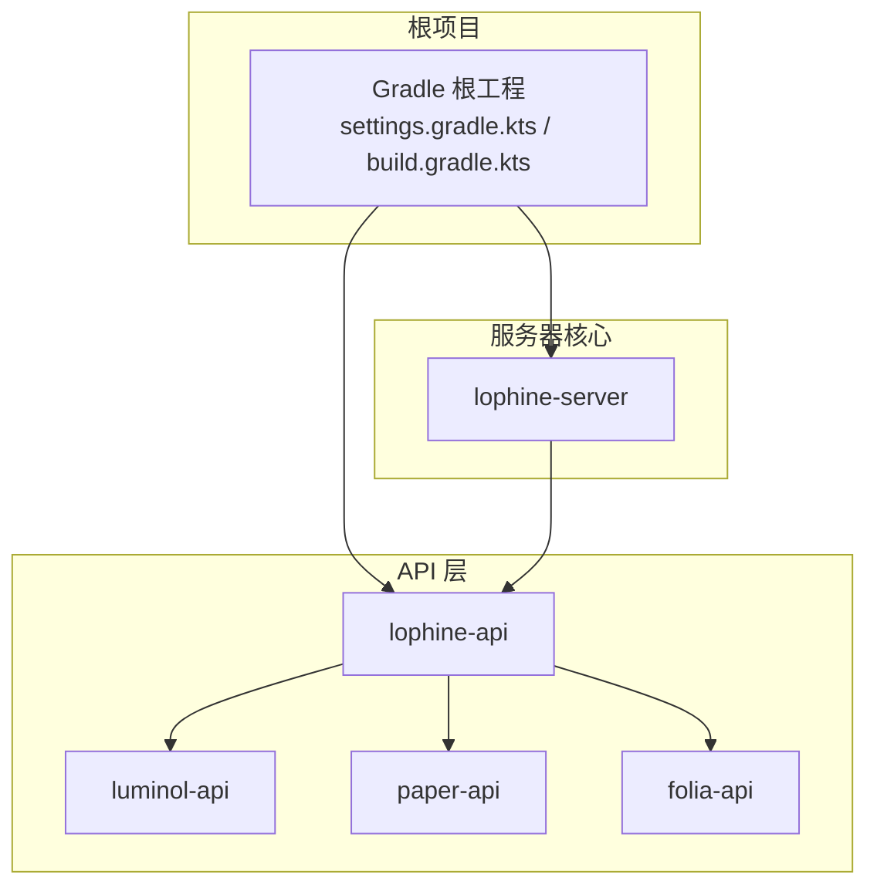
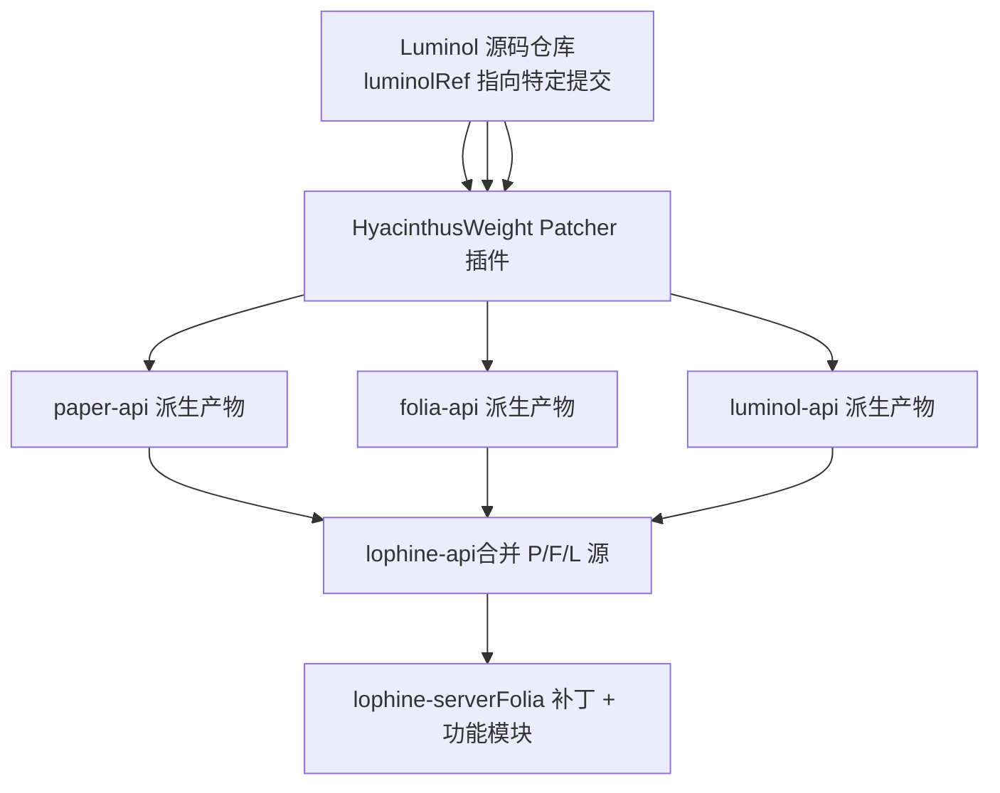
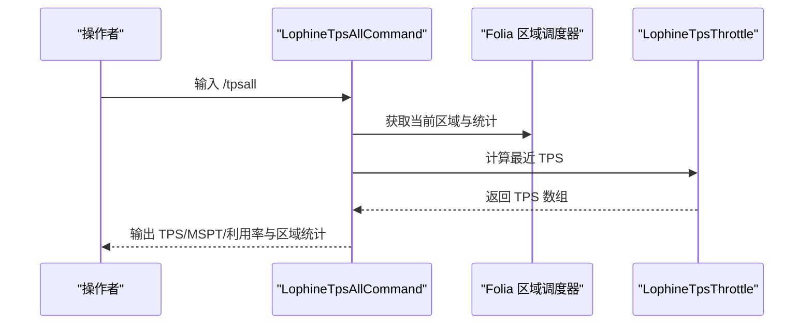
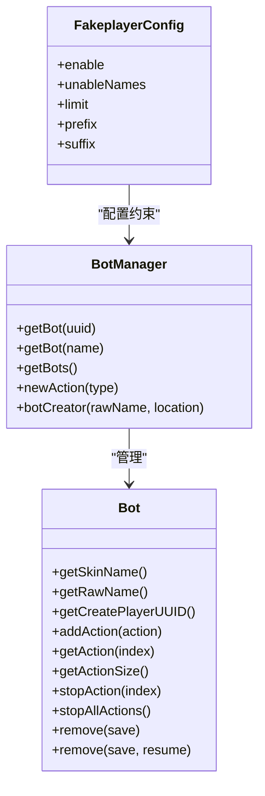
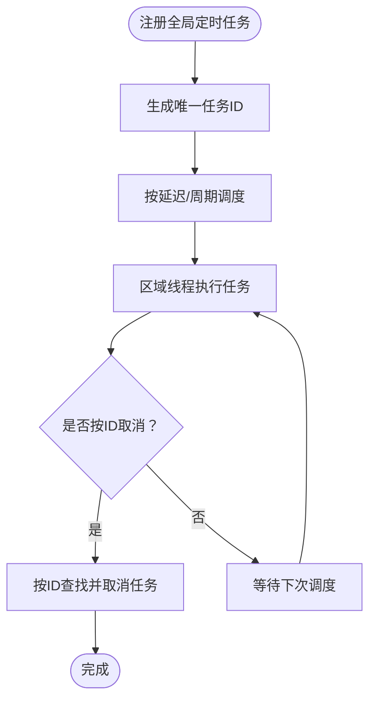
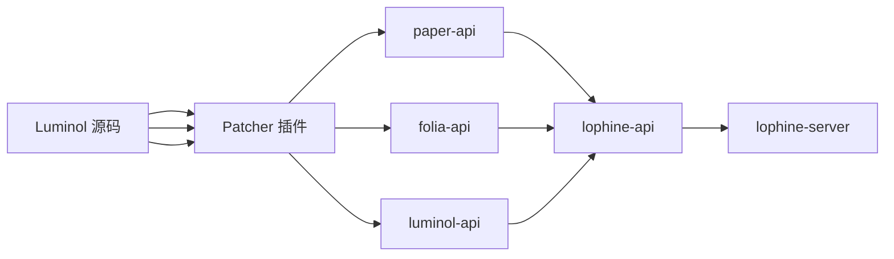

# 项目介绍与定位

<cite>
**本文引用的文件**   
- [README.md](file://README.md)
- [README_EN.md](file://README_EN.md)
- [build.gradle.kts](file://build.gradle.kts)
- [settings.gradle.kts](file://settings.gradle.kts)
- [gradle.properties](file://gradle.properties)
- [carpet-compat-status.md](file://docs/carpet-compat-status.md)
- [LophineTpsAllCommand.java](file://lophine-server/src/main/java/fun/bm/lophine/feature/LophineTpsAllCommand.java)
- [LophineTpsThrottle.java](file://lophine-server/src/main/java/fun/bm/lophine/utils/LophineTpsThrottle.java)
- [CarpetLoggerProtocol.java](file://lophine-server/src/main/java/fun/bm/lophine/protocol/CarpetLoggerProtocol.java)
- [TpsAllConfig.java](file://lophine-server/src/main/java/fun/bm/lophine/config/modules/function/TpsAllConfig.java)
- [LophineBotUtil.java](file://lophine-server/src/main/java/org/leavesmc/leaves/bot/LophineBotUtil.java)
- [0005-Add-cancel-task-by-task-id-in-FoliaGlobalRegionSched.patch](file://lophine-server/paper-patches/features/0005-Add-cancel-task-by-task-id-in-FoliaGlobalRegionSched.patch)
- [0001-Rebrand-to-Lophine.patch](file://lophine-server/paper-patches/features/0001-Rebrand-to-Lophine.patch)
- [BotManager.java](file://lophine-api/src/main/java/org/leavesmc/leaves/entity/bot/BotManager.java)
- [Bot.java](file://lophine-api/src/main/java/org/leavesmc/leaves/entity/bot/Bot.java)
- [FakeplayerConfig.java](file://lophine-server/src/main/java/fun/bm/lophine/config/modules/function/FakeplayerConfig.java)
</cite>

## 目录
1. [引言](#引言)
2. [项目结构](#项目结构)
3. [核心组件](#核心组件)
4. [架构总览](#架构总览)
5. [详细组件分析](#详细组件分析)
6. [依赖关系分析](#依赖关系分析)
7. [性能考量](#性能考量)
8. [故障排查指南](#故障排查指南)
9. [结论](#结论)
10. [附录](#附录)

## 引言
Lophine 是一个基于 Luminol 分支的高性能服务器核心，专注于在 Folia 平台上提供更稳定、可观测且可扩展的生存向功能集。其核心目标是：在保持与原版机制高度兼容的同时，通过可配置的原版特性、完善的 TPS/MSPT 观测、针对 Folia 的专项修复与增强，以及对“生电”（Redstone）功能的强化，为中大型生存服务器提供可靠支撑。

- 与 Luminol 的关系：Lophine 以 Luminol 为基础进行二次开发，继承其核心架构与生态，并在此之上引入了大量针对 Folia 的补丁与功能增强。
- 定位优势：
  - 面向 Folia 的稳定性与性能优化；
  - 可配置的原版特性，满足多样化服务器需求；
  - 实时 TPS/MSPT 观测与区域统计命令；
  - 生电功能增强与协议扩展；
  - 假人系统与回放 API 等实用功能。
- 适用人群：追求稳定与可配置性的生存服务器管理员、需要精细化性能观测的运维团队，以及希望在 Folia 上获得更好体验的开发者。

章节来源
- [README.md:1-157](file://README.md#L1-L157)
- [README_EN.md:1-158](file://README_EN.md#L1-L158)

## 项目结构
Lophine 采用多模块结构，核心包括：
- lophine-api：对外 API 与协议扩展，承载 Leaves/Carpet 等生态能力；
- lophine-server：服务器核心实现，包含命令、配置、协议、功能模块与补丁；
- luminol-api：上游 Luminol 的 API 层，作为基础依赖；
- paper-api、folia-api：Paper/Folia 的 API 抽象层；
- 文档与脚本：贡献指南、兼容性状态、构建脚本等。

图表来源
- [settings.gradle.kts:21-25](file://settings.gradle.kts#L21-L25)
- [build.gradle.kts:46-109](file://build.gradle.kts#L46-L109)

章节来源
- [settings.gradle.kts:1-25](file://settings.gradle.kts#L1-L25)
- [build.gradle.kts:1-118](file://build.gradle.kts#L1-L118)
- [gradle.properties:1-18](file://gradle.properties#L1-L18)

## 核心组件
- 可配置的原版特性：通过配置模块灵活调整游戏机制，适配不同服务器策略。
- TPS/MSPT 观测：提供 /tpsall 命令与区域统计，帮助管理员实时掌握服务器负载。
- Folia 专项修复：针对 Folia 的线程模型与调度问题进行修复与增强。
- 生电功能增强：在 Folia 上实现更多红石可用性（完整生电建议使用 Fabric）。
- 假人系统与回放 API：支持假人创建、动作编排与回放录制，便于自动化与演示场景。
- 协议扩展：集成多种客户端可视化协议（如 Jade、REI、Servux 等），提升可观测性与可视化体验。

章节来源
- [README.md:23-31](file://README.md#L23-L31)
- [README_EN.md:23-31](file://README_EN.md#L23-L31)

## 架构总览
Lophine 的整体架构围绕“上游 Luminol + 多层补丁 + 服务器核心 + API 扩展”的模式展开。构建流程通过 patcher 插件从 Luminol 源码派生出 lophine-api 与 lophine-server，并在其中叠加针对 Folia 的补丁与功能增强。

图表来源
- [build.gradle.kts:9-41](file://build.gradle.kts#L9-L41)
- [gradle.properties:10](file://gradle.properties#L10)

章节来源
- [build.gradle.kts:1-118](file://build.gradle.kts#L1-L118)
- [gradle.properties:1-18](file://gradle.properties#L1-L18)

## 详细组件分析

### TPS/MSPT 观测与区域统计
- /tpsall 命令：输出当前区域的 TPS、MSPT、峰值 MSPT 与区域利用率，并展示区块、玩家、实体数量等统计。
- 配置模块：通过 TpsAllConfig 控制是否启用该命令及其输出的区域数量上限。
- 性能指标：LophineTpsThrottle 提供最近 TPS 值的计算方法，用于命令与日志输出。

图表来源
- [LophineTpsAllCommand.java:32-101](file://lophine-server/src/main/java/fun/bm/lophine/feature/LophineTpsAllCommand.java#L32-L101)
- [LophineTpsThrottle.java:40-56](file://lophine-server/src/main/java/fun/bm/lophine/utils/LophineTpsThrottle.java#L40-L56)
- [TpsAllConfig.java:14-45](file://lophine-server/src/main/java/fun/bm/lophine/config/modules/function/TpsAllConfig.java#L14-L45)

章节来源
- [LophineTpsAllCommand.java:1-101](file://lophine-server/src/main/java/fun/bm/lophine/feature/LophineTpsAllCommand.java#L1-L101)
- [TpsAllConfig.java:1-45](file://lophine-server/src/main/java/fun/bm/lophine/config/modules/function/TpsAllConfig.java#L1-L45)
- [LophineTpsThrottle.java:1-56](file://lophine-server/src/main/java/fun/bm/lophine/utils/LophineTpsThrottle.java#L1-L56)

### 假人系统与配置
- API 接口：Bot 与 BotManager 定义了假人的生命周期、动作管理与创建接口。
- 服务器实现：FakeplayerConfig 提供启用开关、命名限制、数量上限与前后缀等配置；BotUtil 提供合法性校验与 UUID 生成等工具方法。
- Folia 线程安全：LophineBotUtil 提供线程不匹配告警与节流，避免在 Folia 区域线程外执行导致的竞争与异常。

图表来源
- [BotManager.java:31-65](file://lophine-api/src/main/java/org/leavesmc/leaves/entity/bot/BotManager.java#L31-L65)
- [Bot.java:30-103](file://lophine-api/src/main/java/org/leavesmc/leaves/entity/bot/Bot.java#L30-L103)
- [FakeplayerConfig.java:15-35](file://lophine-server/src/main/java/fun/bm/lophine/config/modules/function/FakeplayerConfig.java#L15-L35)

章节来源
- [BotManager.java:1-65](file://lophine-api/src/main/java/org/leavesmc/leaves/entity/bot/BotManager.java#L1-L65)
- [Bot.java:1-103](file://lophine-api/src/main/java/org/leavesmc/leaves/entity/bot/Bot.java#L1-L103)
- [FakeplayerConfig.java:1-35](file://lophine-server/src/main/java/fun/bm/lophine/config/modules/function/FakeplayerConfig.java#L1-L35)
- [LophineBotUtil.java:87-112](file://lophine-server/src/main/java/org/leavesmc/leaves/bot/LophineBotUtil.java#L87-L112)

### Folia 平台增强与补丁
- 任务调度增强：在 FoliaGlobalRegionScheduler 中新增任务 ID 生成与按 ID 取消任务的能力，便于插件侧精细控制定时任务。
- 品牌重定向：在服务器品牌兼容性中加入 Lophine，确保客户端识别与协议一致性。
- 线程安全告警：针对 Folia 区域线程模型，提供线程不匹配的警告与节流，降低竞态风险。

图表来源
- [0005-Add-cancel-task-by-task-id-in-FoliaGlobalRegionSched.patch:1-101](file://lophine-server/paper-patches/features/0005-Add-cancel-task-by-task-id-in-FoliaGlobalRegionSched.patch#L1-L101)
- [0001-Rebrand-to-Lophine.patch:77-100](file://lophine-server/paper-patches/features/0001-Rebrand-to-Lophine.patch#L77-L100)

章节来源
- [0005-Add-cancel-task-by-task-id-in-FoliaGlobalRegionSched.patch:1-101](file://lophine-server/paper-patches/features/0005-Add-cancel-task-by-task-id-in-FoliaGlobalRegionSched.patch#L1-L101)
- [0001-Rebrand-to-Lophine.patch:1-100](file://lophine-server/paper-patches/features/0001-Rebrand-to-Lophine.patch#L1-L100)
- [LophineBotUtil.java:87-112](file://lophine-server/src/main/java/org/leavesmc/leaves/bot/LophineBotUtil.java#L87-L112)

### 协议与可视化扩展
- 协议支持：CarpetLoggerProtocol 支持 tps、mobcaps、counter 等日志器的默认选项与订阅行为，便于在客户端侧进行性能观测。
- 文档与兼容：carpet-compat-status.md 明确了与 Carpet 系列规则的映射关系，帮助用户理解功能承接与差异。

章节来源
- [CarpetLoggerProtocol.java:291-302](file://lophine-server/src/main/java/fun/bm/lophine/protocol/CarpetLoggerProtocol.java#L291-L302)
- [carpet-compat-status.md:1-90](file://docs/carpet-compat-status.md#L1-L90)

## 依赖关系分析
- 构建依赖：Gradle 通过 HyacinthusWeight Patcher 插件从 Luminol 源码派生出 paper-api、folia-api 与 luminol-api，并将其合并到 lophine-api；随后 lophine-server 依赖 lophine-api。
- 运行时依赖：lophine-server 依赖 Paper/Folia 的线程化区域调度器与相关 API，以实现 Folia 平台的性能与稳定性保障。
- 版本与分支：gradle.properties 指定 mcVersion 与 luminolRef，确保构建的一致性与可追溯性。

图表来源
- [build.gradle.kts:9-41](file://build.gradle.kts#L9-L41)
- [gradle.properties:10](file://gradle.properties#L10)

章节来源
- [build.gradle.kts:1-118](file://build.gradle.kts#L1-L118)
- [gradle.properties:1-18](file://gradle.properties#L1-L18)

## 性能考量
- Folia 区域化调度：利用区域线程模型减少锁竞争，提高高密度世界下的吞吐。
- 线程安全与告警：通过 LophineBotUtil 的线程不匹配告警与节流，避免在错误线程执行导致的性能抖动与崩溃。
- TPS/MSPT 观测：/tpsall 命令与 LophineTpsThrottle 提供细粒度性能指标，便于定位瓶颈与优化资源分配。
- 任务调度增强：新增任务 ID 与按 ID 取消能力，有助于插件侧精细化控制任务生命周期，降低无效开销。

章节来源
- [LophineBotUtil.java:87-112](file://lophine-server/src/main/java/org/leavesmc/leaves/bot/LophineBotUtil.java#L87-L112)
- [LophineTpsAllCommand.java:1-101](file://lophine-server/src/main/java/fun/bm/lophine/feature/LophineTpsAllCommand.java#L1-L101)
- [LophineTpsThrottle.java:1-56](file://lophine-server/src/main/java/fun/bm/lophine/utils/LophineTpsThrottle.java#L1-L56)
- [0005-Add-cancel-task-by-task-id-in-FoliaGlobalRegionSched.patch:1-101](file://lophine-server/paper-patches/features/0005-Add-cancel-task-by-task-id-in-FoliaGlobalRegionSched.patch#L1-L101)

## 故障排查指南
- 线程不匹配告警：若看到类似“线程不匹配（Folia 区域竞态）”的警告，通常表示在非拥有区域线程上调用了需要线程安全的操作。应将相关逻辑迁移到区域线程或使用调度器安全封装。
- 任务取消失败：若按 ID 取消任务未生效，确认任务 ID 是否正确生成、是否存在重复 ID 或已被回收。
- /tpsall 输出为空：服务器启动时间较短时可能尚未收集到区域数据，稍后再试或检查区域统计是否正常。
- 假人创建失败：检查 FakeplayerConfig 的命名限制、数量上限与前后缀配置，确保名称合法且未被占用。

章节来源
- [LophineBotUtil.java:87-112](file://lophine-server/src/main/java/org/leavesmc/leaves/bot/LophineBotUtil.java#L87-L112)
- [0005-Add-cancel-task-by-task-id-in-FoliaGlobalRegionSched.patch:44-55](file://lophine-server/paper-patches/features/0005-Add-cancel-task-by-task-id-in-FoliaGlobalRegionSched.patch#L44-L55)
- [LophineTpsAllCommand.java:74-76](file://lophine-server/src/main/java/fun/bm/lophine/feature/LophineTpsAllCommand.java#L74-L76)
- [FakeplayerConfig.java:17-35](file://lophine-server/src/main/java/fun/bm/lophine/config/modules/function/FakeplayerConfig.java#L17-L35)

## 结论
Lophine 以 Luminol 为基石，在 Folia 平台上实现了更稳健的运行时、更丰富的可配置性与更强的可观测能力。通过 TPS/MSPT 区域统计、假人系统、协议扩展与多项 Folia 专项修复，Lophine 为生存服务器提供了兼顾稳定性与可玩性的核心支撑。对于追求完整“生电”体验的用户，建议结合 Fabric 生态进一步完善；而对于需要在 Folia 上获得更好性能与可观测性的团队，Lophine 则是一个值得信赖的选择。

## 附录
- 版本与分支：当前版本号与 Minecraft 版本在 gradle.properties 中定义，luminolRef 指向上游 Luminol 的特定提交，确保构建一致性。
- 文档与兼容：carpet-compat-status.md 提供了与 Carpet 系列规则的映射关系，便于迁移与对比。

章节来源
- [gradle.properties:1-18](file://gradle.properties#L1-L18)
- [carpet-compat-status.md:1-90](file://docs/carpet-compat-status.md#L1-L90)