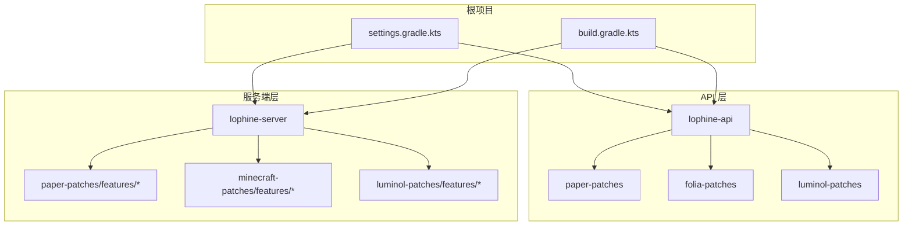
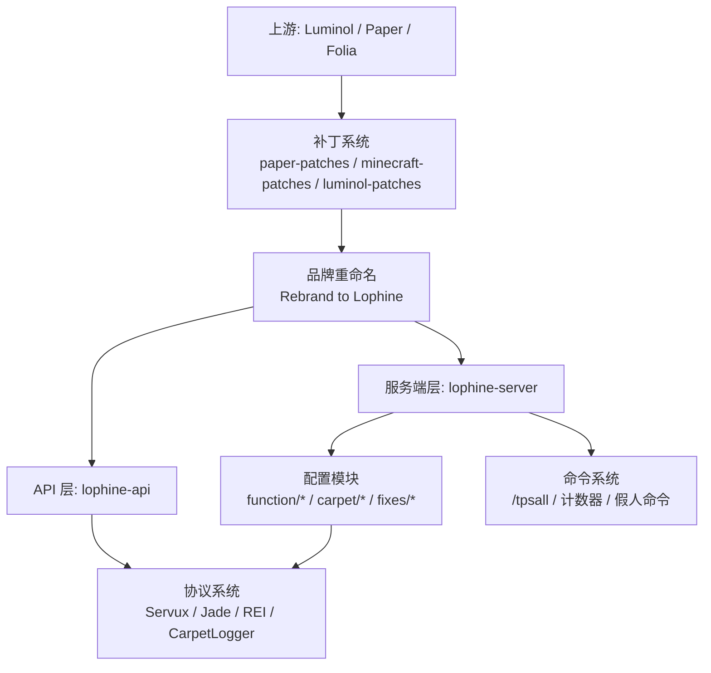
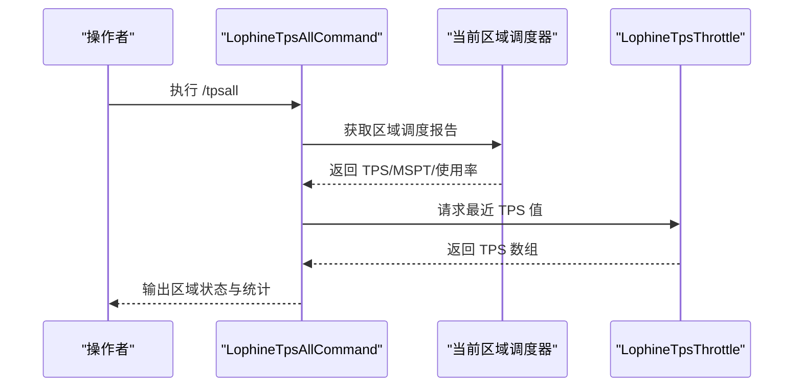
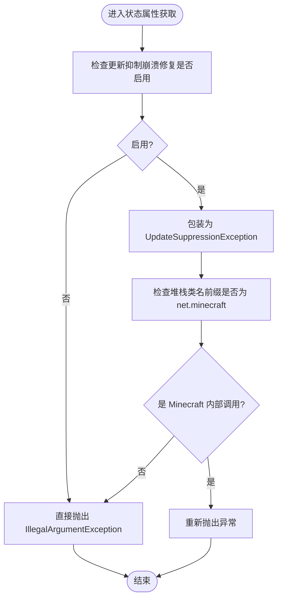
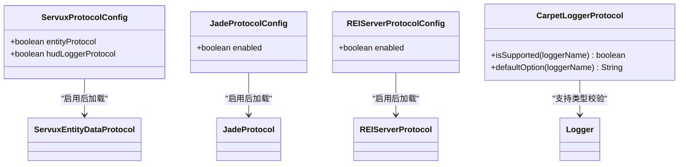
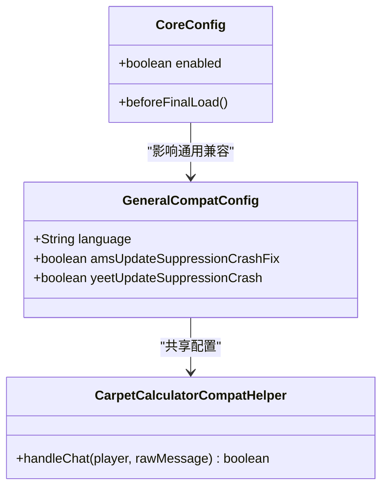
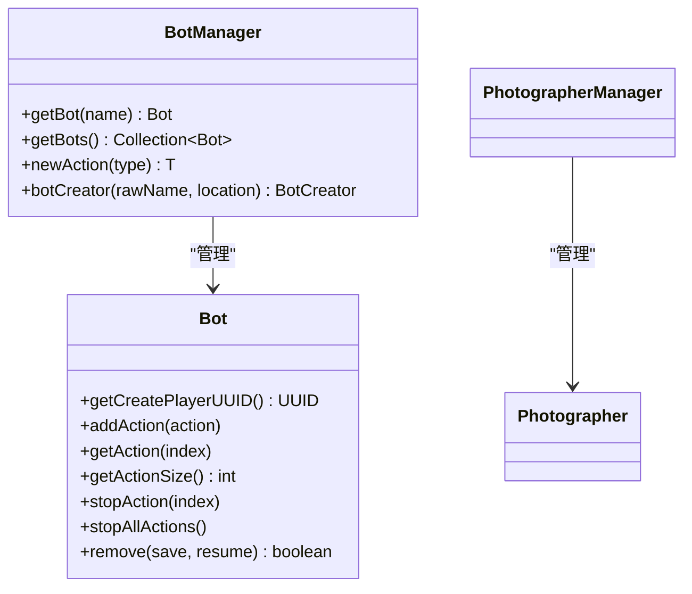
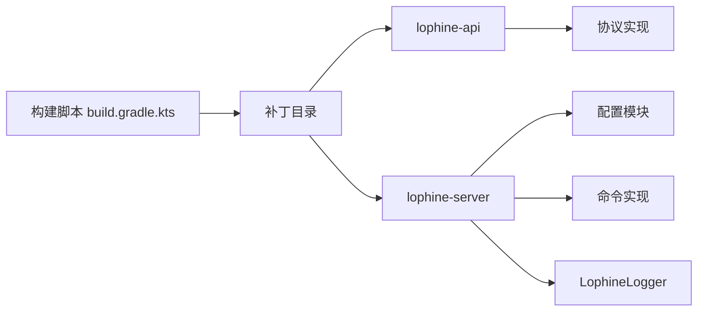

# 项目概述

<cite>
**本文引用的文件**
- [README.md](file://README.md)
- [README_EN.md](file://README_EN.md)
- [build.gradle.kts](file://build.gradle.kts)
- [settings.gradle.kts](file://settings.gradle.kts)
- [LophineLogger.java](file://lophine-server/src/main/java/fun/bm/lophine/LophineLogger.java)
- [LophineTpsAllCommand.java](file://lophine-server/src/main/java/fun/bm/lophine/feature/LophineTpsAllCommand.java)
- [TpsAllConfig.java](file://lophine-server/src/main/java/fun/bm/lophine/config/modules/function/TpsAllConfig.java)
- [LophineTpsThrottle.java](file://lophine-server/src/main/java/fun/bm/lophine/utils/LophineTpsThrottle.java)
- [CarpetLoggerProtocol.java](file://lophine-server/src/main/java/fun/bm/lophine/protocol/CarpetLoggerProtocol.java)
- [ServuxProtocolConfig.java](file://lophine-server/src/main/java/fun/bm/lophine/config/modules/function/protocol/ServuxProtocolConfig.java)
- [ServuxEntityDataProtocol.java](file://lophine-server/src/main/java/org/leavesmc/leaves/protocol/servux/ServuxEntityDataProtocol.java)
- [ServuxProtocol.java](file://lophine-server/src/main/java/org/leavesmc/leaves/protocol/servux/ServuxProtocol.java)
- [ServuxHudDataProtocol.java](file://lophine-server/src/main/java/org/leavesmc/leaves/protocol/servux/ServuxHudDataProtocol.java)
- [REIServerProtocolConfig.java](file://lophine-server/src/main/java/fun/bm/lophine/config/modules/function/protocol/REIServerProtocolConfig.java)
- [JadeProtocolConfig.java](file://lophine-server/src/main/java/fun/bm/lophine/config/modules/function/protocol/JadeProtocolConfig.java)
- [CoreConfig.java](file://lophine-server/src/main/java/fun/bm/lophine/carpet/config/modules/CoreConfig.java)
- [GeneralCompatConfig.java](file://lophine-server/src/main/java/fun/bm/lophine/carpet/config/modules/GeneralCompatConfig.java)
- [CarpetCalculatorCompatHelper.java](file://lophine-server/src/main/java/fun/bm/lophine/carpet/CarpetCalculatorCompatHelper.java)
- [Bot.java](file://lophine-api/src/main/java/org/leavesmc/leaves/entity/bot/Bot.java)
- [BotManager.java](file://lophine-api/src/main/java/org/leavesmc/leaves/entity/bot/BotManager.java)
- [CONTRIBUTING.md](file://docs/CONTRIBUTING.md)
- [0044-Carpet-features.patch](file://lophine-server/minecraft-patches/features/0044-Carpet-features.patch)
- [0032-Leaves-Catch-update-suppression-crash.patch](file://lophine-server/minecraft-patches/features/0032-Leaves-Catch-update-suppression-crash.patch)
- [0001-Rebrand-to-Lophine.patch](file://lophine-server/paper-patches/features/0001-Rebrand-to-Lophine.patch)
- [0001-Rebrand-to-Lophine.patch](file://lophine-server/minecraft-patches/features/0001-Rebrand-to-Lophine.patch)
- [build.gradle.kts.patch](file://lophine-server/build.gradle.kts.patch)
</cite>

## 目录
1. [引言](#引言)
2. [项目结构](#项目结构)
3. [核心组件](#核心组件)
4. [架构总览](#架构总览)
5. [详细组件分析](#详细组件分析)
6. [依赖关系分析](#依赖关系分析)
7. [性能考量](#性能考量)
8. [故障排查指南](#故障排查指南)
9. [结论](#结论)
10. [附录](#附录)

## 引言
Lophine 是一个基于 Luminol 的分支项目，专注于在 Folia 平台上提供更优的生存可用性与功能扩展。它通过可配置的原版特性、TPS 监控、Folia 已知问题修复以及多存档格式支持，为服务器管理员与开发者提供稳定高效的运行时体验。项目强调“在 Folia 上实现更多生电内容”，并明确指出完整生电能力应由 Fabric 提供。

- 核心定位：在 Folia 上提供 Luminol 的优化与可配置特性，增强服务器稳定性与可观测性。
- 主要优势：TPS 实时监控、Folia 兼容性修复、多存档格式支持、协议互通（如 Servux、Jade、REI）、可配置的原版行为。
- 发展方向：持续扩展功能模块与协议支持，提升在多线程调度平台下的性能与稳定性。

章节来源
- [README.md:1-157](file://README.md#L1-L157)
- [README_EN.md:1-158](file://README_EN.md#L1-L158)

## 项目结构
Lophine 采用多模块结构，核心分为 lophine-api 与 lophine-server 两大子项目，并通过补丁系统与上游 Luminol/Paper/Folia 进行集成。Gradle 设置与构建脚本定义了 fork 与补丁应用流程，确保在保持上游一致性的同时引入 Lophine 的定制化改动。

图表来源
- [settings.gradle.kts:21-25](file://settings.gradle.kts#L21-L25)
- [build.gradle.kts:4-41](file://build.gradle.kts#L4-L41)

章节来源
- [settings.gradle.kts:1-25](file://settings.gradle.kts#L1-L25)
- [build.gradle.kts:1-118](file://build.gradle.kts#L1-L118)

## 核心组件
- 可配置原版特性：通过配置模块暴露大量原版行为开关，覆盖语言、红石、实体计数、创意飞行穿模、容器扩容等，满足不同服务器需求。
- TPS 监控与可视化：提供 /tpsall 命令与 TPS 统计工具，输出区域级 TPS、MSPT、使用率与区域统计，便于实时观测性能瓶颈。
- Folia 兼容性修复：针对更新抑制崩溃等已知问题提供修复补丁，保障在多线程区域调度下的稳定性。
- 协议互通：支持 Servux、Jade、REI 等客户端可视化协议，实现 HUD、实体数据、配方展示等功能。
- 假人与摄影功能：提供 Bot API 与摄影管理器，支持自动化任务与回放录制。
- 补丁与重打包：通过补丁系统整合上游改动，统一品牌标识与功能增强。

章节来源
- [README.md:23-31](file://README.md#L23-L31)
- [README_EN.md:23-31](file://README_EN.md#L23-L31)
- [TpsAllConfig.java:14-45](file://lophine-server/src/main/java/fun/bm/lophine/config/modules/function/TpsAllConfig.java#L14-L45)
- [LophineTpsAllCommand.java:32-101](file://lophine-server/src/main/java/fun/bm/lophine/feature/LophineTpsAllCommand.java#L32-L101)
- [ServuxProtocolConfig.java:12-24](file://lophine-server/src/main/java/fun/bm/lophine/config/modules/function/protocol/ServuxProtocolConfig.java#L12-L24)
- [REIServerProtocolConfig.java:8-13](file://lophine-server/src/main/java/fun/bm/lophine/config/modules/function/protocol/REIServerProtocolConfig.java#L8-L13)
- [JadeProtocolConfig.java:8-13](file://lophine-server/src/main/java/fun/bm/lophine/config/modules/function/protocol/JadeProtocolConfig.java#L8-L13)
- [Bot.java:46-103](file://lophine-api/src/main/java/org/leavesmc/leaves/entity/bot/Bot.java#L46-L103)
- [BotManager.java:41-65](file://lophine-api/src/main/java/org/leavesmc/leaves/entity/bot/BotManager.java#L41-L65)

## 架构总览
Lophine 的架构围绕“上游补丁 + 自定义增强”的模式展开。构建阶段通过补丁系统将 Luminol/Paper/Folia 的改动与本地定制合并，形成最终的服务端产物；运行时通过配置模块与协议系统对外提供功能与可观测性。

图表来源
- [build.gradle.kts:9-41](file://build.gradle.kts#L9-L41)
- [0001-Rebrand-to-Lophine.patch:54-80](file://lophine-server/paper-patches/features/0001-Rebrand-to-Lophine.patch#L54-L80)
- [0001-Rebrand-to-Lophine.patch:1-8](file://lophine-server/minecraft-patches/features/0001-Rebrand-to-Lophine.patch#L1-L8)
- [build.gradle.kts.patch:7-25](file://lophine-server/build.gradle.kts.patch#L7-L25)

## 详细组件分析

### TPS 监控与 /tpsall 命令
- 功能概述：提供区域级 TPS/MSPT/使用率统计与区域统计信息，支持中文输出与权限控制。
- 关键实现：
  - 命令节点注册与执行：LophineTpsAllCommand
  - 配置模块：TpsAllConfig 控制是否启用与展示区域数量
  - 性能采样：LophineTpsThrottle 提供最近 TPS 值转换
- 使用场景：运维监控、性能调优、异常定位

图表来源
- [LophineTpsAllCommand.java:40-101](file://lophine-server/src/main/java/fun/bm/lophine/feature/LophineTpsAllCommand.java#L40-L101)
- [TpsAllConfig.java:28-45](file://lophine-server/src/main/java/fun/bm/lophine/config/modules/function/TpsAllConfig.java#L28-L45)
- [LophineTpsThrottle.java:40-56](file://lophine-server/src/main/java/fun/bm/lophine/utils/LophineTpsThrottle.java#L40-L56)

章节来源
- [LophineTpsAllCommand.java:18-101](file://lophine-server/src/main/java/fun/bm/lophine/feature/LophineTpsAllCommand.java#L18-L101)
- [TpsAllConfig.java:14-45](file://lophine-server/src/main/java/fun/bm/lophine/config/modules/function/TpsAllConfig.java#L14-L45)
- [LophineTpsThrottle.java:40-56](file://lophine-server/src/main/java/fun/bm/lophine/utils/LophineTpsThrottle.java#L40-L56)

### Folia 兼容性修复与更新抑制崩溃保护
- 修复要点：针对更新抑制导致的崩溃，通过配置开关与异常包装策略，将潜在崩溃转化为可控异常链，避免服务中断。
- 关键实现：
  - 异常包装与条件抛出：在特定条件下抛出自定义 UpdateSuppressionException
  - 配置模块：UpdateSuppressionCrashFixConfig.enabled 控制开关
- 适用场景：高并发区域更新、复杂红石/机械场景

图表来源
- [0032-Leaves-Catch-update-suppression-crash.patch:183-190](file://lophine-server/minecraft-patches/features/0032-Leaves-Catch-update-suppression-crash.patch#L183-L190)

章节来源
- [0032-Leaves-Catch-update-suppression-crash.patch:183-190](file://lophine-server/minecraft-patches/features/0032-Leaves-Catch-update-suppression-crash.patch#L183-L190)

### 协议互通：Servux、Jade、REI 与 CarpetLogger
- Servux 协议：支持实体数据与 HUD 日志协议，配置项 ServuxProtocolConfig 控制开关。
- Jade 协议：提供方块/实体信息展示，配置项 JadeProtocolConfig 控制开关。
- REI 协议：提供配方展示，配置项 REIServerProtocolConfig 控制开关。
- CarpetLogger 协议：支持 tps、mobcaps、counter 等日志类型，默认选项按类型设定。

图表来源
- [ServuxProtocolConfig.java:12-24](file://lophine-server/src/main/java/fun/bm/lophine/config/modules/function/protocol/ServuxProtocolConfig.java#L12-L24)
- [JadeProtocolConfig.java:8-13](file://lophine-server/src/main/java/fun/bm/lophine/config/modules/function/protocol/JadeProtocolConfig.java#L8-L13)
- [REIServerProtocolConfig.java:8-13](file://lophine-server/src/main/java/fun/bm/lophine/config/modules/function/protocol/REIServerProtocolConfig.java#L8-L13)
- [CarpetLoggerProtocol.java:291-302](file://lophine-server/src/main/java/fun/bm/lophine/protocol/CarpetLoggerProtocol.java#L291-L302)

章节来源
- [ServuxEntityDataProtocol.java:50-54](file://lophine-server/src/main/java/org/leavesmc/leaves/protocol/servux/ServuxEntityDataProtocol.java#L50-L54)
- [ServuxProtocol.java:26-36](file://lophine-server/src/main/java/org/leavesmc/leaves/protocol/servux/ServuxProtocol.java#L26-L36)
- [ServuxHudDataProtocol.java:1-49](file://lophine-server/src/main/java/org/leavesmc/leaves/protocol/servux/ServuxHudDataProtocol.java#L1-L49)
- [CarpetLoggerProtocol.java:291-302](file://lophine-server/src/main/java/fun/bm/lophine/protocol/CarpetLoggerProtocol.java#L291-L302)

### 可配置的原版特性与 Carpet 兼容
- 核心配置：CoreConfig 控制是否启用 Carpet 功能，启用时会触发同步逻辑。
- 通用兼容：GeneralCompatConfig 映射语言、更新抑制崩溃修复等兼容规则。
- 计算器兼容：CarpetCalculatorCompatHelper 处理以“=”开头的聊天表达式计算，返回结果或错误提示。

图表来源
- [CoreConfig.java:14-29](file://lophine-server/src/main/java/fun/bm/lophine/carpet/config/modules/CoreConfig.java#L14-L29)
- [GeneralCompatConfig.java:18-29](file://lophine-server/src/main/java/fun/bm/lophine/carpet/config/modules/GeneralCompatConfig.java#L18-L29)
- [CarpetCalculatorCompatHelper.java:11-42](file://lophine-server/src/main/java/fun/bm/lophine/carpet/CarpetCalculatorCompatHelper.java#L11-L42)

章节来源
- [CoreConfig.java:14-29](file://lophine-server/src/main/java/fun/bm/lophine/carpet/config/modules/CoreConfig.java#L14-L29)
- [GeneralCompatConfig.java:18-29](file://lophine-server/src/main/java/fun/bm/lophine/carpet/config/modules/GeneralCompatConfig.java#L18-L29)
- [CarpetCalculatorCompatHelper.java:11-42](file://lophine-server/src/main/java/fun/bm/lophine/carpet/CarpetCalculatorCompatHelper.java#L11-L42)
- [0044-Carpet-features.patch:1028-1046](file://lophine-server/minecraft-patches/features/0044-Carpet-features.patch#L1028-L1046)

### 假人与摄影功能（Bot 与 Photographer）
- Bot 接口：提供动作管理、移除、保存与恢复等能力。
- BotManager：提供假人创建、动作实例化与集合视图。
- 摄影师：提供摄影相关的管理器与游戏模式封装。

图表来源
- [Bot.java:46-103](file://lophine-api/src/main/java/org/leavesmc/leaves/entity/bot/Bot.java#L46-L103)
- [BotManager.java:41-65](file://lophine-api/src/main/java/org/leavesmc/leaves/entity/bot/BotManager.java#L41-L65)

章节来源
- [Bot.java:46-103](file://lophine-api/src/main/java/org/leavesmc/leaves/entity/bot/Bot.java#L46-L103)
- [BotManager.java:41-65](file://lophine-api/src/main/java/org/leavesmc/leaves/entity/bot/BotManager.java#L41-L65)

## 依赖关系分析
- 构建期依赖：通过 paperweight 插件与补丁系统，将上游 Luminol/Paper/Folia 的改动与本地补丁合并，最终生成 lophine-server。
- 运行期依赖：API 层提供协议与事件接口，服务端层通过配置模块与命令系统消费这些接口。
- 日志与工具：LophineLogger 提供统一日志入口，便于调试与审计。

图表来源
- [build.gradle.kts:9-41](file://build.gradle.kts#L9-L41)
- [LophineLogger.java:6-8](file://lophine-server/src/main/java/fun/bm/lophine/LophineLogger.java#L6-L8)

章节来源
- [build.gradle.kts:1-118](file://build.gradle.kts#L1-L118)
- [LophineLogger.java:6-8](file://lophine-server/src/main/java/fun/bm/lophine/LophineLogger.java#L6-L8)

## 性能考量
- 区域级调度：利用 Folia 的区域调度模型，结合 /tpsall 输出的区域使用率，识别热点区域并进行资源隔离或负载均衡。
- TPS/MSPT 监控：通过 LophineTpsThrottle 与命令输出，快速定位高耗时段落与异常峰值。
- 协议开销：Servux/Jade/REI 等协议在启用时会带来网络与序列化开销，建议仅在需要时开启并配合权限控制。
- 更新抑制保护：在高并发场景下启用更新抑制崩溃修复，避免异常扩散导致的连锁反应。

## 故障排查指南
- 启动与构建
  - 确认已应用补丁并成功生成 Paperclip JAR。
  - 若出现品牌标识不一致，检查 paper 与 minecraft 补丁中的重命名变更。
- TPS 监控
  - 若 /tpsall 输出为空或延迟，确认服务器运行时间足够收集统计。
  - 检查权限与配置模块启用状态。
- 协议互通
  - 仅在客户端安装对应 Mod 且服务端配置启用时生效。
  - 如出现连接异常，检查协议版本与服务端日志。
- 更新抑制崩溃
  - 启用更新抑制崩溃修复配置，观察异常是否被包装为可控异常链。
  - 定位异常堆栈，确认是否来自 Minecraft 内部调用。

章节来源
- [README.md:32-51](file://README.md#L32-L51)
- [README_EN.md:32-51](file://README_EN.md#L32-L51)
- [0032-Leaves-Catch-update-suppression-crash.patch:183-190](file://lophine-server/minecraft-patches/features/0032-Leaves-Catch-update-suppression-crash.patch#L183-L190)

## 结论
Lophine 在 Luminol 基础上，针对 Folia 平台进行了深度优化与功能增强，提供了可配置的原版特性、完善的 TPS 监控、稳定的更新抑制保护以及丰富的协议互通能力。通过模块化的配置与清晰的补丁体系，既满足初学者的易用性需求，也为高级用户提供深入定制的空间。未来可在协议生态扩展、性能分析工具完善与自动化运维方面持续演进。

## 附录
- 社区与支持：提供 QQ、Telegram、Discord 等渠道，Issue 与 Discussions 用于问题反馈与讨论。
- 贡献指南：遵循贡献流程，使用个人仓库 Fork，关注补丁系统与开发环境要求。

章节来源
- [README.md:88-120](file://README.md#L88-L120)
- [README_EN.md:89-120](file://README_EN.md#L89-L120)
- [CONTRIBUTING.md:1-38](file://docs/CONTRIBUTING.md#L1-L38)